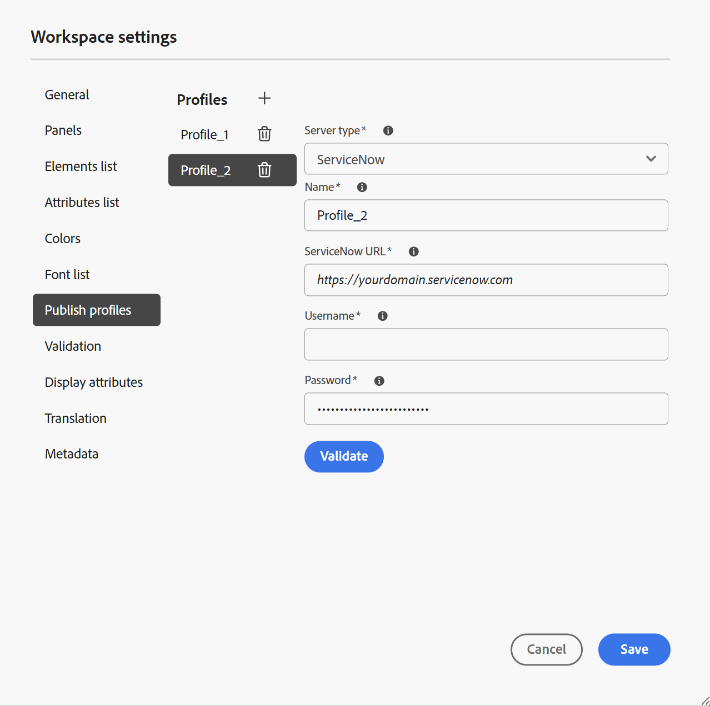

# Configurações do Workspace

A opção **Configurações do Workspace** presente na [Barra de guias](./web-editor-tab-bar.md) do Editor está disponível somente para administradores e administradores de perfil de pasta e permite definir as seguintes configurações:

- [Geral](#general)
- [Painéis](#panels)
- [Lista Elementos](#elements-list)
- [Lista de atributos](#attributes-list)
- [Cores](#colors)
- [Publicar perfis](#publish-profiles)
- [Validação](#validation)
- [Exibir atributos](#display-attributes)
- [Tradução](#translation)
- [Metadados](#metadata)

>[!NOTE]
>
> Se estiver atualizando qualquer configuração padrão, você deverá reabrir os documentos para que as alterações entrem em vigor.

## Geral

As configurações Gerais permitem definir as configurações para usar o Editor. Esta guia contém cinco seções: **Assistente de IA**, **Criação**, **Citações**, **Condição** e **Verificação ortográfica**.

{width="350" align="left"}

- **Assistente de IA**
Selecione esta opção para habilitar o recurso [Assistente de IA](./ai-assistant.md) no Experience Manager Guides. Desmarque para desativar o recurso.

  Depois de habilitar a opção de alternância **Assistente de IA**, você pode configurar quais opções serão exibidas na **guia Criação** para autores usando o menu **Ações rápidas de criação**, conforme mostrado abaixo.\
  Essas alterações se aplicam ao perfil de pasta específico com o qual você está trabalhando. Se você criar um novo perfil de pasta, ele herdará as configurações do Workspace definidas no perfil de pasta **Global** por padrão. Você pode modificar essas configurações conforme necessário usando as **configurações do Workspace** e salvar a configuração atualizada.\
  Para obter uma visão geral detalhada das opções disponíveis para Criação usando o Assistente de IA, exiba [Crie documentos de forma inteligente com o Assistente de IA](./ai-assistant-right-panel.md).

  No menu **Ações rápidas de criação**, você pode:

   - use os botões para ativar ou desativar opções específicas que os autores podem acessar ao trabalhar com o Assistente de IA.

   - altere a ordem na qual as opções são exibidas, arraste-as e solte-as conforme necessário.

  {width="350" align="left"}

- **Criação**

   - **Habilitar Substituir Tudo**: selecione esta opção para exibir o ícone **Substituir Tudo** no painel **Localizar e substituir**.

- **Citações**

  Alterar o estilo das citações. Escolha o estilo da citação no menu suspenso que deseja usar em seu projeto. Para obter mais detalhes, consulte [Alterar estilos de citação](./web-editor-apply-citations.md#change-citation-style).

- **Condição**

   - **Realçar texto condicional no modo de exibição Autor**: selecione essa opção para realçar o texto condicional no modo de exibição Autor. O conteúdo condicional é realçado usando a cor definida para a condição.

   - **Validar com atributos de condição**: selecione essa opção para permitir a validação dos valores definidos para os atributos. Isso impede que você adicione qualquer valor incorreto.

   - **Mostrar chave com o título no painel Esquema de Assunto**: selecione essa opção para mostrar as chaves junto com títulos no esquema de assunto. Se você não selecionar essa opção, somente os títulos serão exibidos. Por exemplo, aqui as chaves &quot;os&quot;, &quot;audience&quot; e &quot;other&quot; também são mostradas junto com títulos.

     {width="550" align="left"}

   - **Mostrar esquema de assunto no painel Condições**: selecione esta opção para exibir um esquema de assunto no painel Condições. Se você desmarcar essa opção, as condições definidas serão mostradas no painel Condições.

- **Verificação ortográfica**
Há duas opções: **verificação ortográfica do AEM** e **verificação ortográfica do navegador**. Por padrão, o editor usa o recurso de verificação ortográfica do navegador, no qual a verificação ortográfica é executada usando o dicionário interno do navegador. Você pode alternar para a verificação ortográfica do AEM para usar o dicionário do Adobe Experience Manager, que também pode ser personalizado para adicionar sua lista de palavras personalizada. Para obter mais informações sobre como personalizar o dicionário do AEM, consulte [Personalizar o dicionário padrão do AEM](../cs-install-guide/customize-aem-custom-dictionary.md) na seção Instalar e configurar o Adobe Experience Manager Guides as a Cloud Service.

## Painéis

Essa configuração controla os painéis exibidos nos painéis esquerdo e direito do Editor e do console de Mapa. Você pode alternar o botão para mostrar ou ocultar o painel desejado.

{width="650" align="left"}

Você também pode definir a ordem em que os recursos presentes nos painéis são exibidos. Para alterar a ordem padrão dos recursos disponíveis nos painéis, selecione as barras pontilhadas para arrastar e soltar as guias de recursos no local desejado. Um recurso também pode ser movido da seção **Mais** para a seção principal de um painel, e vice-versa de acordo com o requisito. Depois de reordenados, os recursos aparecem na mesma sequência nos respectivos painéis direito e esquerdo.

{width="650" align="left"}

No máximo oito painéis podem ser exibidos de cada vez. Quaisquer alterações feitas nas configurações do painel são aplicadas imediatamente.

>[!NOTE]
>
> Se um painel personalizado tiver sido configurado, ele também aparecerá na lista de painéis. Você pode alternar o botão para mostrar ou ocultar o painel personalizado.

## Lista Elementos

Como administrador, você pode controlar a lista de elementos que um autor pode inserir em um arquivo e também definir o nome de exibição do elemento. A configuração da lista Elementos permite especificar o nome do elemento de acordo com as especificações DITA e um rótulo que você deseja usar em vez do nome do elemento definido por DITA:

{width="650" align="left"}

Na captura de tela acima, o elemento `p` recebeu um rótulo de Parágrafo, e `codeblock` recebeu um rótulo de Bloco de Código junto com alguns outros elementos. Se você selecionar a opção **Usar somente os elementos acima**, então somente os elementos válidos \(no ponto de inserção atual\) desta lista serão exibidos na caixa de diálogo **Inserir elemento**.

Na captura de tela a seguir, apenas 3 dos 4 elementos configurados da captura de tela anterior são mostrados no contexto atual:

{width="300" align="left"}

## Lista de atributos

Semelhante à lista de elementos, você pode controlar a lista de atributos e seus nomes de exibição a serem exibidos na lista de atributos de um elemento. Na captura de tela a seguir, apenas 3 atributos foram configurados para serem mostrados na lista de atributos de um elemento:

{width="650" align="left"}

Com essa configuração, ao tentar adicionar um atributo a um elemento, você só visualiza a lista de atributos configurados na lista.

{width="300" align="left"}

## Cores

Exibe uma lista de cores de fundo pré-configuradas para **Condições**. Os usuários podem selecionar uma cor de plano de fundo ao aplicar uma condição a um tópico. Como administrador, você também pode criar e adicionar cores de fundo personalizadas à lista. Para adicionar uma nova cor, digite o nome desejado no campo **Nome da Cor**, escolha uma cor personalizada e selecione o ícone **+**. A cor personalizada aparecerá no final da lista de cores.

## Publicar perfis

Ela contém os Perfis que podem ser usados para publicar a saída da **Base de Dados de Conhecimento**. Você pode criar um novo perfil para uma base de dados de conhecimento de destino. Por exemplo, Salesforce ou ServiceNow.

**Criar um perfil do Salesforce**

**Pré-requisitos**

- Crie um aplicativo conectado para o Salesforce. Para obter mais detalhes, consulte [Habilitar configurações do OAuth para integração com a API](https://help.salesforce.com/s/articleView?id=sf.connected_app_create_api_integration.htm&type=5).

- Ao configurar o aplicativo conectado, verifique o seguinte:

   - Especifique o retorno de chamada.

     `URL: http://<server name>:<port>/bin/dxml/thirdparty/callback/salesforce`

   - Selecione os seguintes escopos do OAuth:
      - Acesso total (total)
      - Selecione Gerenciar dados do usuário por meio das APIs (api)

     Depois que o aplicativo é configurado, a Salesforce fornece uma **Chave do consumidor** e um **Segredo do consumidor**. Eles podem ser usados para criar o perfil do Salesforce.

   - Para criar um perfil do Salesforce, selecione a Base de Dados de Conhecimento **Salesforce** na lista suspensa **Tipo de servidor**. Insira um Nome de perfil. No **URL do Site**, insira o site do consumidor que você usaria para publicar a saída e adicionar a **Chave do Consumidor** e o **Segredo do Consumidor** fornecidos pelo site do consumidor do Salesforce. Em seguida, **Validar** e **Salvar** o perfil recém-criado.

     {width="550" align="left"}

     >[!NOTE]
     >
     >Para configurar um proxy para o Salesforce no Experience Manager Guides, use Configuração de proxy de componentes HTTP do Apache no AEM. Saiba como [configurar proxy para o Verificador de Links do AEM](https://helpx.adobe.com/experience-manager/kb/How-to-configure-proxy-for-the-AEM-Link-Checker-AEM.html).

**Criar um perfil do ServiceNow**

**Pré-requisitos**

Configure o servidor ServiceNow para fazer upload dos ativos.

- Conecte-se ao servidor **ServiceNow**.
- Navegue até **Propriedades do Sistema** > **Segurança**.
- Desmarque a seguinte opção:

  **Esta propriedade deve ser definida para ativar a verificação de tipo MIME para carregamentos (Todas as versões Eureka e superiores). Ativa (true) ou desativa (false) a validação do tipo MIME para os anexos de arquivo. Extensões de arquivo configuradas via glide.attachment.extensions serão verificadas em busca de tipo MIME durante o carregamento.**

- Selecione **Salvar**.

  Depois de configurar o aplicativo, crie o perfil do **ServiceNow**.

- Para criar um perfil, selecione a Base de Dados de Conhecimento ServiceNow na lista suspensa **Tipo de servidor**. Insira um perfil **Nome**. Na **URL do ServiceNow**, insira o site do consumidor que você usaria para publicar a saída e, em seguida, adicione o **Nome de Usuário** e a **Senha** fornecidos pelo site do consumidor do ServiceNow. Em seguida, **Validar** e **Salvar** o perfil recém-criado.

  {width="550" align="left"}

  Depois de validar, você pode selecionar o Perfil de Publicação nas predefinições de saída de um Mapa DITA e usá-lo para gerar a saída para o servidor do **Salesforce** ou do **ServiceNow** escolhido.

  Saiba mais sobre a predefinição de saída da [Base de Dados de Conhecimento](../user-guide/generate-output-knowledge-base.md).

## Validação

Esta guia contém opções para configurar as validações do Schematron no Editor. Você pode ativar os seguintes recursos:

- **Executar verificação de validação antes de salvar o arquivo**: selecione essa opção para executar validações de Esquematron usando os arquivos de Esquematron selecionados antes de qualquer operação de salvamento. Você pode adicionar um arquivo do Schematron selecionando o ícone +. Os arquivos do Schematron selecionados são listados.

  >[!NOTE]
  >
  > O(s) arquivo(s) de esquema selecionado(s) persistirá(ão) no perfil de pasta selecionado.

  {width="550" align="left"}

  Isso impede que os usuários salvem qualquer arquivo que quebre uma regra definida no(s) arquivo(s) selecionado(s) do Schematron. Se esta opção não estiver selecionada, o arquivo não será validado antes de salvar as alterações.

- **Permitir que todos os usuários adicionem arquivos de esquematron no painel de validação**: selecione essa opção para permitir que os usuários adicionem qualquer arquivo de Esquematron no painel Validação do Editor. Isso permite que os usuários adicionem arquivos do Schematron e, em seguida, validem os tópicos em relação ao arquivo Schematron. Se esta opção não estiver selecionada, a opção para adicionar o arquivo de esquematron **botão Adicionar Arquivo de Esquematron** não estará disponível para os usuários no **Painel de validação** do Editor.

## Exibir atributos

Assim como a lista Atributos, você pode controlar a lista de atributos a ser exibida na lista de atributos de um elemento. Por padrão, quatro **Atributos de exibição** — público-alvo, plataforma, produto e propriedades foram configurados para serem mostrados na lista de atributos de um elemento. Você também pode adicionar um atributo de exibição usando o ícone **Adicionar** na parte superior. Você também pode excluir qualquer um dos atributos de exibição usando o ícone **Excluir**.

Os atributos definidos para um elemento são exibidos na exibição Layout e Estrutura de Tópicos.

{width="550" align="left"}

## Tradução

Essa guia contém as opções para criar grupos de idiomas, propagar os rótulos de origem para a versão de destino e limpar o projeto de tradução.

{width="550" align="left"}

- **Grupos de Idiomas**: como administrador, você pode criar um grupo de idiomas e usá-los como um conjunto para traduzir o conteúdo.

  Execute as seguintes etapas para criar um novo grupo de idiomas:

   1. Selecione **Adicionar**.
   1. Informe o nome do grupo de idiomas. Cada idioma deve ter um nome exclusivo. Você pode exibir um erro se o campo de nome estiver vazio ou se o nome não for exclusivo.
   1. Selecione os idiomas na lista suspensa. Você pode selecionar vários idiomas.

      Digite os primeiros caracteres do idioma ou o código do idioma para filtrar os idiomas desejados. Por exemplo, digite &#39;en&#39; para filtrar todos os idiomas que contêm &#39;en&#39; no início de seu nome ou código.

   1. Selecione o ícone Concluído para adicionar os idiomas selecionados ao grupo. Os idiomas são exibidos. Quando você adiciona três ou mais idiomas, a opção **Mostrar mais** é exibida. Você pode selecionar **Mostrar mais** para exibir todos os idiomas presentes no grupo.

      >[!TIP]
      >
      > Alternar **Mostrar mais** para **Mostrar menos** e exibir apenas alguns idiomas.

   1. Passe o mouse sobre os idiomas em um grupo para editar o  ou excluir os grupos de idiomas .
   1. Salve as **Configurações**.

      >[!NOTE]
      >
      >Como usuário, você pode exibir os grupos de idiomas configurados para o perfil da pasta.

- **Propagar rótulos de versão de origem para a versão de destino**: selecione esta opção para passar o rótulo da versão do arquivo de origem para o arquivo traduzido. Por padrão, está desativado.
- **Limpeza do projeto de tradução após a conclusão**: selecione essa opção para configurar os projetos de tradução a serem desabilitados ou excluídos automaticamente após a tradução. Por padrão, **Nenhum** está selecionado, portanto, o projeto existe após a tradução.

  Você pode desativar os projetos de tradução se desejar usá-los posteriormente. A exclusão de um projeto exclui permanentemente todos os arquivos e pastas presentes no projeto.

## Metadados

Você pode controlar os metadados de versão do tópico e seus valores a serem exibidos na caixa de diálogo **Histórico de versão**.  No caminho dos metadados, especifique a localização dos nós dos quais deseja selecionar os metadados. Também é possível definir um nome personalizado para os metadados como o rótulo. As propriedades padrão são Título, Estado do documento e Tags.

Os metadados podem ser escolhidos de qualquer propriedade no nó `/jcr:content` do ativo, de modo que você possa adicionar o caminho da propriedade como o caminho de Metadados.

Um erro é exibido se o caminho de metadados estiver em branco. Se você deixar o rótulo em branco, o último elemento será escolhido como o rótulo.

{width="550" align="left"}

*Configure os metadados da caixa de diálogo **Histórico de Versões**.*

Você também pode definir a ordem em que essas tags de metadados são exibidas. Para alterar a ordem padrão dessas tags, selecione as barras pontilhadas para arrastar e soltar as tags no local desejado.
Os rótulos de metadados aparecem na mesma sequência na caixa de diálogo **Histórico de versões** do Editor.

**Tópico pai:**&#x200B;[&#x200B; Introdução ao Editor](web-editor.md)
