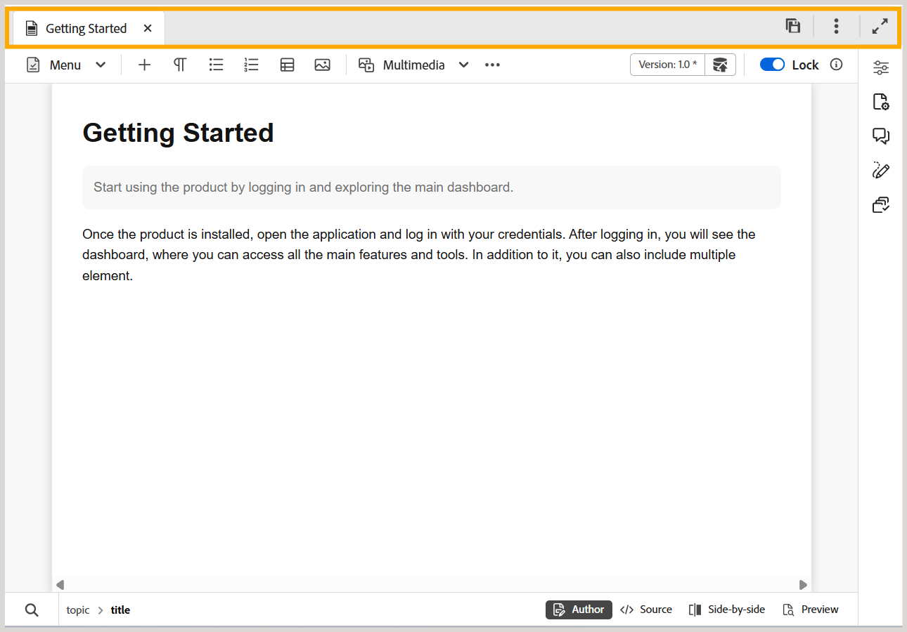

# Barra de guias no editor

>[!INFO]
>
> Este tópico se aplica ao Novo editor e ao Editor antigo. Embora a funcionalidade principal permaneça consistente, diferenças na interface do usuário, terminologia e interações são indicadas no conteúdo usando guias e chamadas de retorno, quando aplicável.

A barra de guias está na parte superior da interface do Editor e fornece acesso aos vários recursos de nível de arquivo.

>[!BEGINTABS]

>[!TAB Novo editor]

>[!TAB Editor Antigo]

>[!ENDTABS]

**Guias**

Exibe os tópicos atualmente abertos no Editor como guias de arquivo. É possível abrir vários tópicos ao mesmo tempo, que são exibidos em suas respectivas guias na barra de guias. Por padrão, é possível exibir os títulos dos arquivos nas guias. Ao passar o mouse sobre um arquivo, é possível visualizar o título do arquivo e o caminho do arquivo como uma dica de ferramenta.

>[!NOTE]
>
> Como administrador, você também pode optar por exibir a lista de arquivos por nomes de arquivo nas guias. Selecione a opção **Nome do arquivo** na seção **Configuração de exibição dos arquivos do editor** em [Preferências do usuário](./intro-home-page.md#user-preferences).

Selecionar a guia Arquivo abre um menu de contexto com as opções Salvar como nova versão, Copiar, Localizar em, Adicionar a, Propriedades, Dividir, Baixar como PDF e Fechar.

**Salvar tudo**

Salva as alterações feitas em todos os tópicos abertos. Se você tiver vários tópicos abertos no Editor, selecionar **Salvar tudo** ou usar as teclas de atalho **Ctrl**+**S** salvará todos os documentos com um único clique. Não é necessário salvar cada documento individualmente.

>[!NOTE]
>
> A operação **Salvar tudo** não cria uma nova versão dos tópicos. Para criar uma nova versão, use a opção **Salvar como nova versão**.

O **Assistente de IA**: o Assistente de IA está disponível de dois modos: **Agente** e **Padrão**.

>[!NOTE]
>
> Para usar o recurso Assistente de IA em modo Agêntico em seu ambiente, entre em contato com a equipe de Sucesso do cliente. Após ativar o recurso, os administradores podem ativá-lo ou desativá-lo nas Configurações do Workspace. Somente um modo do Assistente de IA pode ser ativado por vez: Agente ou Padrão.

- **Agnetic**: traz a habilidade inteligente e agêntica de Marcação Inteligente do Adobe CX Enterprise Coworker para o Editor, permitindo a marcação de conteúdo natural e conversacional. Ele analisa seu conteúdo, recomenda tags relevantes e ajuda a aplicar metadados consistentes e precisos com o mínimo esforço. Você pode revisar as tags sugeridas e optar por aplicá-las ou rejeitá-las antes de confirmar sua seleção. [Usar o Assistente de IA no Modo de Agente](../user-guide/ai-assistant-agentic.md) simplifica o processo de marcação, melhorando a organização e a descoberta do conteúdo.

- **Padrão**: uma ferramenta avançada orientada por IA, projetada para aprimorar sua produtividade através de recursos de ajuda inteligentes. Além disso, ao trabalhar na interface do Editor, você pode aproveitar os recursos de criação inteligente do Assistente de IA, que tornam o processo de criação mais inteligente e rápido por meio de sugestões inteligentes para reutilização e otimização de conteúdo.

No momento, o recurso [Assistente de IA](./ai-assistant.md) está disponível apenas para o Adobe Experience Manager as Cloud Service.

**Expandir exibição**: permite expandir a exibição de página usando o ícone **Expandir**. Nesta visualização, a barra de cabeçalho que contém o logotipo do Adobe Experience Manager está oculta. Isso maximiza o espaço de conteúdo para edição. Para retornar ao modo de exibição padrão, use o ícone **Sair do modo de exibição expandido**.

**Mais ações**: fornece acesso a opções adicionais. Selecionar esse botão abre um menu com as seguintes opções:

- **Assets**: leva você a um destino com base em sua configuração.
  - **Serviços em Nuvem**: se você estiver usando os Serviços em Nuvem, selecionar a opção **Assets** o levará à página Navegação da AEM.

  - **Software Local**: se estiver usando o Adobe Experience Manager Guides (4.2.1 e posterior), selecionar a opção **Assets** levará você ao caminho do arquivo atual na interface do usuário do Assets.
- **Configurações do Workspace**: Leva você à caixa de diálogo de configurações do Workspace. Para obter detalhes, consulte [Definir configurações do Workspace](../install-conf-guide/workspace-settings.md).

>[!NOTE]
>
>Se estiver usando o Adobe Experience Manager Guides em uma configuração no local anterior à versão 5.2, a opção de configurações do Workspace continuará a aparecer como **Configurações** no menu Mais ações.

- **Configurações do editor**: Leva você à caixa de diálogo Configurações do editor, onde é possível personalizar o comportamento do editor em um nível de autor individual. Ela permite controlar a visibilidade e o comportamento de tags, comentários e outras configurações no nível do editor durante a criação. Para obter detalhes, exiba [Configurações do editor](../user-guide/config-editor-settings.md).

**Tópico pai:**[ Introdução ao Editor](web-editor.md)
