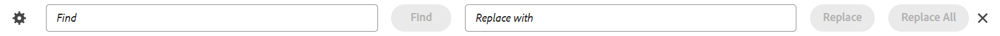
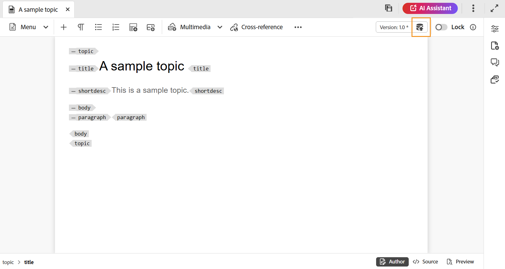

# Barra de ferramentas no editor

A barra de ferramentas aparece quando você abre um tópico ou mapa para edição no Editor. Os recursos disponíveis na barra de ferramentas são os seguintes:

- [Menu suspenso](#menu-dropdown)
- [Opções de inserção de conteúdo](#content-insertion-options)
- [Botão Informações de versão e Salvar como nova versão](#version-information-and-save-as-new-version)
- [Bloquear/desbloquear](#lockunlock)

>[!NOTE]
>
> Os recursos listados acima são aplicáveis somente a arquivos de tópico. Ao trabalhar com um arquivo de mapa, opções diferentes são exibidas na barra de ferramentas com base na exibição atual do Editor de mapa. Saiba mais sobre as opções da barra de ferramentas do Editor de mapas no documento [Recursos do editor de mapas](./map-editor-advanced-map-editor.md).

## Menu suspenso

A lista suspensa Menu fornece acesso às ações de edição, Localizar e substituir, Histórico de versão, Rótulo de versão, Mesclar, Criar tarefa de revisão e menu Mostrar (que inclui Rastrear alterações, Tags, Espaço não-separável).

{width="350" align="left"}

Veja a seguir a explicação detalhada desses recursos:

**Editar ações**

Ao editar um tópico no Editor, acesse as várias ações de edição, como **Recortar** ou ***Ctrl***+***X*** , **Copiar** ou ***Ctrl***+***C*** , **Desfazer** ou ***Ctrl***+***Z*** , **Refazer** ou ***Ctrl***+***Y*** e **Excluir** presentes na lista suspensa Menu.

**Localizar e substituir**

O recurso **Localizar e substituir** está disponível nos modos de exibição Autor e Source. Quando ativada, a barra de texto Localizar e Substituir aparece na parte inferior da área de edição de tópico. Você pode usar as teclas de atalho **CTRL**+**F** para invocar a barra Localizar e substituir.

{align="left"}

Usando o ícone de configurações \(\), você pode alternar as opções de pesquisa **Ignorar maiúsculas e minúsculas** e **Somente palavra inteira**. Para executar a pesquisa que não diferencia maiúsculas de minúsculas, ative a opção **Ignorar maiúsculas e minúsculas**. Caso contrário, se você deseja realizar a pesquisa que diferencia maiúsculas de minúsculas, desative a opção **Ignorar maiúsculas e minúsculas**. Você também pode optar por pesquisar uma palavra inteira.

A pesquisa é instantânea, o que significa que à medida que você digita a frase ou palavra de pesquisa no campo **Localizar**, o termo é imediatamente pesquisado e selecionado no tópico. Da mesma forma, para substituir um texto em seu tópico, insira o termo de pesquisa e sua substituição nos respectivos campos e selecione o botão **Substituir** ou **Substituir tudo**.

No modo de exibição do Source, o recurso **Localizar e substituir** é extremamente útil para procurar um elemento ou atributo específico. Por exemplo, se você deseja substituir o valor do atributo `@product`, ele pode ser facilmente feito no modo de exibição Source. A visualização Autor não permite que você pesquise com base em um atributo ou elemento. No entanto, você deve ter cuidado ao usar o recurso **Substituir tudo**, pois ele pode substituir o código XML.

**Histórico de versões**

O recurso **Histórico de versões** no Editor permite verificar as versões disponíveis dos arquivos DITA, compará-las e reverter para qualquer versão do próprio Editor. É possível comparar o conteúdo e os metadados da versão atual (que também pode ser uma cópia de trabalho) com qualquer versão anterior do mesmo arquivo. Também é possível exibir os rótulos e comentários das versões comparadas.

>[!NOTE]
>
> As opções de Histórico de versão só serão exibidas se houver alterações feitas na primeira versão do tópico ou mapa.

    
 Etapas para acessar o histórico de versões 

1. Abra um tópico no Editor.
1. Selecione o **Histórico de versões** na lista suspensa **Menu**.

   A caixa de diálogo **Histórico da Versão** é exibida.

   {width="550" align="left"}

   *Visualize as alterações nas diferentes versões de um tópico.*

1. Escolha uma versão do tópico que você deseja comparar ou reverter na lista suspensa **Comparar com**.

   >[!NOTE]
   >
   > Se uma versão tiver rótulos aplicados a ela, eles também serão mostrados \(entre colchetes\) junto com o número da versão.

1. Habilite a opção **Exibir rótulos e comentários** para exibir os rótulos e comentários aplicados às versões atual e comparada.
1. Você também pode exibir as seguintes informações na caixa de diálogo **Histórico de versões**:

   Guia **Visualizar**: o conteúdo recém-adicionado está em fonte verde e o conteúdo excluído está em fonte vermelha.

   Guia **Metadata**: os metadados recém-adicionados estão em fonte verde e os metadados excluídos estão em fonte vermelha.

   {width="550" align="left"}

   *Comparar os metadados de diferentes versões no histórico de Versões.*

   >[!NOTE]
   >
   > O administrador do sistema pode alterar os metadados a serem mostrados na guia Metadados em **Configurações**. Para obter detalhes, consulte a seção **Mais ações** da [Barra de guias](./web-editor-tab-bar.md).

   Você também pode exibir os detalhes de usuário e tempo da versão atual e da versão comparada.

   Depois de escolher uma versão na lista suspensa, a opção **Reverter para a versão selecionada** é disponibilizada. A janela de visualização exibe as diferenças entre a versão atual e a versão selecionada do tópico.

1. Selecione **Reverter para a versão selecionada** para reverter sua cópia de trabalho com a versão selecionada do tópico.

   A caixa de diálogo Reverter versão é exibida.

   {width="550" align="left"}

1. \(*Opcional*\) Forneça um motivo para reverter para uma versão anterior. Você também pode criar uma nova versão da cópia de trabalho ativa do tópico.

1. Selecione **Confirmar**.

   Sua cópia de trabalho do arquivo foi revertida para a versão selecionada. Se você optar por criar uma nova versão da cópia de trabalho ativa no momento, uma nova versão do arquivo também será criada com todas as alterações de trabalho.

   Quando você reverte para uma versão anterior, uma dica visual é mostrada, indicando que a versão em que você está trabalhando no momento não é a versão mais recente.

   {align="left"}

**Rótulos de versão**

Os rótulos ajudam a identificar o estágio em que um tópico específico está no DDLC \(Document Development Life Cycle\). Por exemplo, ao trabalhar em um tópico, você pode definir o rótulo como &quot;Aprovado&quot;. Depois que um tópico é publicado e disponibilizado aos clientes, é possível atribuir o rótulo &quot;Lançado&quot; a esse tópico.

O Experience Manager Guides permite especificar rótulos em um formato de texto livre ou usar um conjunto de rótulos predefinidos. O rótulo personalizado permitiria que qualquer autor no sistema especificasse um rótulo de acordo com sua escolha. Isso dá flexibilidade; no entanto, introduz rótulos inconsistentes no sistema. Para resolver esse problema, os administradores podem configurar um conjunto de rótulos predefinidos. Para obter mais informações sobre como configurar rótulos predefinidos, consulte *Configurar e personalizar o Editor da Web de XML* em Instalar e configurar o Adobe Experience Manager Guides as a Cloud Service.

Esses rótulos são mostrados na forma de uma lista suspensa para os autores sempre que eles precisarem especificar um rótulo. Isso garante que somente rótulos predefinidos e consistentes sejam usados no sistema.

Há diferentes métodos pelos quais você pode aplicar rótulos aos seus tópicos - painel [Histórico de versões](web-editor-use-label.md) na interface do usuário do Assets, interface do usuário [Linhas de Base](/help/product-guide/user-guide/generate-output-use-baseline-for-publishing.md) e editor. O recurso Rótulo de versão no Editor oferece aos autores uma maneira rápida e fácil de atribuir rótulos a seus tópicos.

    
 Etapas para adicionar rótulos ao seu tópico no Editor 

1. Abra um tópico no Editor.

1. Selecione **Rótulos de versão** na lista suspensa Menu.

   A caixa de diálogo Gerenciamento de Rótulos de Versão é exibida.

   {width="350" align="left"}

   A caixa de diálogo Gerenciamento de rótulo de versão é dividida em duas partes: o painel esquerdo tem uma lista de versões disponíveis para o tópico, juntamente com a lista suspensa de rótulos \(ou uma caixa de texto para inserir um rótulo\) e o painel direito com uma visualização do tópico.

1. Selecione uma versão na qual você deseja aplicar rótulos.

   Quando você escolhe uma versão diferente do tópico na lista de versões, o painel de visualização exibe as alterações entre a versão atual e a versão selecionada do tópico

   >[!NOTE]
   >
   > Se um rótulo já estiver aplicado em uma versão, ele será exibido ao lado do número da versão na lista suspensa e abaixo da lista Selecionar versão. Você pode remover um rótulo existente selecionando o ícone \(**x**\) ao lado do rótulo.

1. Caso o administrador tenha definido uma lista de rótulos, você verá uma lista suspensa dos rótulos de onde poderá escolher os rótulos que deseja aplicar. É possível selecionar vários rótulos na lista suspensa.

   Caso contrário, será exibida uma caixa de texto, na qual você poderá inserir os rótulos que deseja adicionar ao tópico.

   >[!NOTE]
   >
   > Não é possível aplicar o mesmo rótulo a várias versões de um tópico. Se tentar associar um rótulo existente, você terá a opção de removê-lo da versão existente e aplicá-lo na versão selecionada do tópico.

1. Selecione **Adicionar rótulo**.

1. Na mensagem de confirmação Aplicar Rótulo, selecione a opção **Mover rótulo(Se usado em outra versão)** para mover rótulos de uma versão existente para a versão selecionada. Se você não selecionar essa opção e houver rótulos atribuídos a uma versão diferente do tópico, eles não serão movidos para a versão do tópico selecionado. Esses rótulos são ignorados no processo de aplicativo de rótulo.

**Mesclar**

Quando você trabalha em um ambiente de vários autores, fica difícil rastrear as alterações que os outros autores fizeram em um tópico ou mapa. O recurso Mesclar oferece mais controle não apenas sobre a exibição das alterações, mas também sobre quais alterações são mantidas na versão mais recente do documento.

    
 Mesclar arquivos de tópico 

Para mesclar alterações em um tópico, execute as seguintes etapas:

1. Abra um tópico no Editor.

1. Selecione **Mesclar**.

   A caixa de diálogo Mesclar é exibida.

   {width="550" align="left"}

1. *\(Opcional\)* Você também pode procurar e selecionar um novo arquivo em algum outro local do seu repositório.

1. Selecione uma versão do arquivo com a qual deseja comparar a versão atual do arquivo.

1. Em Opções, escolha:

   - **Controlar alterações da versão selecionada**: esta opção mostra todas as atualizações de conteúdo na forma de alterações controladas. Você pode optar por aceitar ou rejeitar as alterações no documento, uma de cada vez, ou todas de uma só vez.

   - **Reverter para a versão selecionada**: essa opção reverte a versão atual do documento para a versão selecionada. Essa opção não oferece controle sobre qual conteúdo é aceito ou rejeitado.

1. Selecione **Concluído**.

1. Se você selecionou a opção **Controlar alterações da versão selecionada**, todas as alterações da versão selecionada serão mostradas no recurso Controlar alterações do painel direito.

   Você pode optar por aceitar ou rejeitar todos os comentários do painel Alterações controladas ou aceitar ou rejeitar comentários individuais.

    
 Mesclar arquivos de mapa 

Para mesclar alterações em um arquivo de mapa, execute as seguintes etapas:

1. Abra um mapa no Editor.

1. Selecione **Mesclar**.

   A caixa de diálogo Mesclar é exibida.

   {width="550" align="left"}

1. *\(Opcional\)* Você também pode procurar e selecionar um novo arquivo em algum outro local do seu repositório.

1. Selecione uma versão do arquivo com a qual deseja comparar a versão atual do arquivo.

1. Em Opções, escolha:

   - **Controlar alterações da versão selecionada**: esta opção mostra todas as atualizações de conteúdo na forma de controlar alterações. Você pode optar por aceitar ou rejeitar as alterações no documento, uma de cada vez, ou todas de uma só vez.

   - **Reverter para a versão selecionada**: essa opção reverte a versão atual do documento para a versão selecionada. Essa opção não oferece controle sobre qual conteúdo é aceito ou rejeitado.

1. Selecione **Concluído**.

1. Se você selecionou a opção **Controlar alterações da versão selecionada**, todas as alterações da versão selecionada serão mostradas no painel Alterações controladas \(à direita\).

   Você pode optar por aceitar ou rejeitar todas as alterações do painel Alterações controladas ou aceitar ou rejeitar alterações individuais no arquivo de mapa.

**Criar tarefa de revisão**

Você pode [criar uma tarefa de revisão](./review-send-topics-for-review.md) do tópico atual ou mapear arquivo diretamente do Editor. Abra o arquivo para o qual deseja criar a tarefa de revisão e selecione **Criar tarefa de revisão** na lista suspensa Menu para iniciar o processo de criação da revisão.

**Mostrar menu**

O menu Mostrar inclui os seguintes recursos:

- **Controlar alterações:** você pode controlar todas as atualizações feitas em um documento habilitando o modo Controlar alterações. Depois de ativar o controle de alterações, todas as inserções e exclusões são capturadas no documento. Todo o conteúdo excluído é realçado usando Tachado e todas as inserções são realçadas em texto de cor verde. Além disso, você também obtém as barras de alteração na borda da página de tópico. Novamente, uma barra vermelha é exibida para o conteúdo excluído, e uma barra verde é exibida para o conteúdo adicionado. Caso haja uma adição e exclusão na mesma linha, as barras verde e vermelha são exibidas.
A captura de tela a seguir destaca o conteúdo excluído e inserido junto com as barras de alteração:
  {width="650" align="left"}

  Um caso de uso típico para rastrear alterações em um documento pode ser para fazer revisão por pares. Você pode habilitar o controle de alterações e compartilhar seu documento para revisão, e o revisor faz alterações com o controle de alterações ATIVADO. Ao receber o documento, você deve ter um mecanismo para visualizar as atualizações sugeridas, juntamente com uma maneira conveniente de aceitar ou rejeitar alterações.

  O Experience Manager Guides fornece o recurso Alterações controladas que contém informações sobre as atualizações feitas no documento. O recurso Alterações rastreadas fornece informações sobre quais atualizações foram feitas, quem as fez e em que momento. Usando o recurso Alterações controladas, você também pode aceitar ou rejeitar facilmente as atualizações sugeridas no documento.

  Para acessar o recurso, selecione o ícone **Controlar alterações** no painel direito.

  {width="300" align="left"}

  Selecionar uma alteração controlada seleciona o conteúdo alterado no documento. Você pode aceitar uma alteração selecionando o ícone Aceitar alteração ou rejeitá-la selecionando Rejeitar alteração.

  Se quiser aceitar ou rejeitar todas as alterações com um único clique, selecione **Aceitar todas as alterações** ou **Rejeitar todas as alterações**.

  >[!NOTE]
  >
  > O modo Visualizar permite visualizar o documento com ou sem as marcações do conteúdo alterado. Para obter mais detalhes, veja o modo [Visualização](web-editor-views.md#preview-mode).

- **Marcas:** O recurso **Marcas** no Editor é um botão de alternância que controla a visibilidade dos elementos DITA. Quando ativado, ele exibe tags estruturais no conteúdo, permitindo que você visualize e gerencie os elementos DITA subjacentes com mais eficiência. Quando desativado, o editor oculta essas tags, fornecendo um ambiente de criação mais limpo e focado.

  A captura de tela a seguir mostra um documento com a exibição de Tags ativada:

  {width="650" align="left"}

  As seguintes operações podem ser executadas em um documento com Tags:

   - **Selecionar um elemento**: selecione a marca de abertura ou de fechamento de um elemento para selecionar seu conteúdo.

   - **Expandir ou recolher marcas**: selecione as marcas + ou - para expandir ou recolher uma marca.

   - **Usar o menu de contexto**: o menu de contexto fornece opções para recortar, copiar ou colar o elemento selecionado. Também é possível inserir um elemento antes ou depois do elemento selecionado. As outras opções permitem Gerar ID ou abrir o painel Propriedades do elemento selecionado.

   - **Arrastar e soltar elementos**: selecione a marca de um elemento e arraste-a e solte-a facilmente no seu documento. Se o local de destino for um local válido onde o elemento é permitido, o elemento será colocado no local de destino.

  >[!NOTE]
  >
  > Se um usuário ativar a visualização Tags no Editor, ela permanecerá ativada mesmo nas sessões. Isso significa que não é necessário habilitar a exibição de Tags novamente para acessá-la posteriormente. O valor padrão para o modo de exibição de Tags da sessão de um novo usuário é determinado pela propriedade `tagsView` no arquivo `ui\_config.json`. Para obter mais detalhes, exiba a seção [Configurar valor padrão para Exibição de Marcas](../cs-install-guide/configure-default-value-tags-view.md) em Instalar e configurar o Adobe Experience Manager Guides as a Cloud Service.

- **Espaço não-separável:** Habilite esta opção para mostrar um indicador para os espaços não-separáveis ao editá-lo no Editor. Ele está visível somente na exibição **Autor** para o tópico DITA e mapas DITA.

## Opções de inserção de conteúdo

**Elemento** - 

Insere um elemento válido no local válido atual ou próximo. Você também pode usar o atalho de teclado ***Alt***+***Enter*** para abrir a caixa de diálogo Elemento. Por exemplo, ao editar um parágrafo, na caixa de diálogo **Elemento**, é exibida uma lista de elementos que podem ser inseridos no parágrafo. Selecione o elemento que deseja inserir. Você pode usar o teclado para percorrer a lista de elementos e pressionar ***Enter*** para inserir o elemento necessário.

Você pode exibir dois tipos de elementos válidos:

- **Elementos válidos no local atual**: a lista exibe os elementos que você pode inserir no próprio local do cursor atual.

- **Elementos válidos fora do local atual**: a lista exibe os elementos que você pode inserir depois de qualquer um dos pais do elemento atual na hierarquia de elementos.

Por exemplo, se você estiver dentro do elemento `<b>` embutido, é possível inserir elementos como `<u>`, `<xref>`, `<i>` no local atual. Por outro lado, você pode inserir elementos como `<table>` e `<topic>` fora do local atual.

Você também pode digitar um caractere ou sequência de caracteres na caixa de pesquisa e pesquisar os elementos que começam com ele.

{width="300" align="left"}

*Digite &#39;t&#39; para procurar todos os elementos válidos que comecem com &#39;t&#39;.*

Se você estiver trabalhando dentro de um elemento de bloco como `note`, use o ícone Inserir elemento para inserir um novo elemento após o elemento `note`. Na captura de tela a seguir, um elemento de nota foi inserido no elemento p \(parágrafo\):

{align="left"}

Se você pressionar Enter no elemento de nota, um novo parágrafo será criado dentro do próprio elemento de nota. Para inserir um novo elemento fora da observação, selecione o elemento p \(destacado na captura de tela\) na navegação estrutural dos elementos e selecione o ícone Elemento ou pressione ***Alt***+***Enter*** para abrir a caixa de diálogo Inserir elemento. Em seguida, selecione o elemento desejado e pressione Enter para inserir o elemento selecionado após o elemento de nota.

Você também pode adicionar um elemento entre dois elementos quando um cursor de bloco intermitente é exibido.

{width="300" align="left"}

Por exemplo, se você estiver trabalhando em um tópico DITA e o cursor de bloco estiver piscando entre a descrição curta e o corpo, é possível adicionar o elemento `prolog` e, em seguida, adicionar direitos autorais, autor e outros detalhes.

Outra maneira de inserir um novo elemento é usando o menu de contexto. Clique com o botão direito do mouse em qualquer lugar do documento para chamar o menu de contexto. Nesse menu, escolha **Inserir Elemento** para exibir a caixa de diálogo **Inserir elemento** e escolha o elemento que deseja inserir.

{width="300" align="left"}

**Parágrafo** - 

Inserir elemento de parágrafo no local válido atual ou próximo.

**Lista com marcadores** - 

Cria uma lista com marcadores no local válido atual ou próximo. Se você estiver em uma lista com marcadores e selecionar esse ícone, o item será convertido em um parágrafo normal.

**Lista numerada** - 

Cria uma lista numerada no local válido atual ou próximo. Se você estiver em uma lista numerada e selecionar esse ícone, o item será convertido em um parágrafo normal.

>[!NOTE]
>
>Você também pode selecionar a opção **Dividir lista** no menu de contexto de um item de lista para dividir a lista atual e iniciar uma nova lista no mesmo nível.

**Tabela** - 

Insere uma tabela no local válido atual ou próximo. Selecione o ícone Tabela para abrir a caixa de diálogo Inserir Tabela Simples.

{width="550" align="left"}

>[!NOTE]
>
> Você também pode copiar uma tabela do MS Word ou Excel e colá-la no arquivo de tópico do Experience Manager Guides. A tabela copiada será colada como `<simpletable>` ou `<tgroup>`, dependendo das configurações definidas na Configuração do Editor de XML. Para obter mais detalhes, consulte [Configurar a exibição de tabelas coladas](../cs-install-guide/conf-pasted-tables.md).

Você pode especificar o número de linhas e colunas necessárias na tabela. Para manter a primeira linha como o cabeçalho da tabela, selecione a opção **Definir primeira linha como cabeçalho**. Para adicionar um título à tabela, insira-o no campo Title.

Depois de inserir uma tabela, você pode modificá-la usando o menu de contexto.

{width="550" align="left"}

Usando o menu de contexto da tabela, você pode:

- Inserir células, linhas ou colunas

- Mesclar células nas direções direita e abaixo

- Dividir células horizontalmente ou verticalmente

- Excluir células, linhas ou colunas

- Gerar IDs

    
 Definir atributos em várias células, linha inteira ou coluna de uma tabela 

Você também pode definir atributos em várias células, linha inteira ou coluna de uma tabela. Por exemplo, para alinhar a célula da tabela, arraste e selecione a célula necessária. No painel Propriedades de Conteúdo (à direita), a propriedade **Type** é alterada para **entry**.

1. Na seção **Atributos**, selecione **+Adicionar**.
1. Selecione o atributo `@valign` na lista suspensa **Atributo**.
1. Na lista suspensa de valores, selecione o alinhamento de texto desejado que deseja aplicar às células selecionadas da tabela.
1. Selecione **Adicionar.**

{align="left"}

**Imagem** - 

Insere uma imagem no local válido atual ou próximo. Selecione o ícone Imagem para abrir a caixa de diálogo Inserir imagem e, em seguida, pesquise e selecione a imagem que deseja inserir.

>[!NOTE]
>
> Você também pode adicionar uma imagem arrastando-a e soltando-a do seu sistema local no seu artigo. Nesse caso, o arquivo de imagem é adicionado usando o fluxo de trabalho **Carregar Assets**.  Para obter mais detalhes, exiba o fluxo de trabalho **Carregar Assets** na seção [Painel esquerdo](./web-editor-left-panel.md).

{width="300" align="left"}

Você pode adicionar uma imagem/Título da Figura e Texto Alternativo para a imagem na caixa de diálogo Inserir Imagem.

>[!NOTE]
>
> Quando você insere uma imagem e especifica um texto alternativo para a mesma, ela é adicionada dentro do elemento `<alt>` de acordo com os padrões DITA mais recentes. O uso do atributo `@alt` para texto alternativo está obsoleto, mas ele permanece com suporte em versões DITA anteriores.

Usando a opção **Selecionar Arquivo**, você pode procurar o arquivo de imagem necessário por nome de arquivo. Você também pode filtrar os resultados da pesquisa por Caminho \(para pesquisar em\), Coleções, Tipo de arquivo e Tags. Depois de encontrar o arquivo de imagem necessário, selecione o arquivo e escolha **Selecionar** para inserir a imagem no documento. Você pode inserir vários formatos de arquivos de imagem, como `.png`, `.svg`, `.gif`, `.jpg`, `.eps`, `.ai`, `.psd` e muito mais.

Depois de inserir uma imagem, você pode alterar a altura, a largura, a disposição e os atributos no painel Propriedades de conteúdo. Selecione o arquivo de imagem e faça as alterações no painel Propriedades de conteúdo no painel direito.

{align="left"}

O campo Source exibe a UUID do arquivo de imagem inserido. Você pode encontrar o caminho completo do arquivo de imagem inserido passando o ponteiro do mouse sobre o campo Source. O caminho é exibido na dica de ferramenta.

Você pode redimensionar uma imagem fornecendo o valor de Altura ou Largura para o arquivo de imagem. A proporção da imagem é mantida automaticamente. Se desejar, você também pode optar por não manter as proporções do arquivo de imagem selecionando o ícone de cadeado \(de Manter Proporções\) e fornecendo valores de Altura e Largura.

Você também pode especificar a configuração de Posicionamento para a imagem como Em linha ou Quebra. Caso opte por usar a opção Inserção de quebra, é possível escolher onde alinhar a imagem (esquerda, centro ou direita).

Você também pode adicionar outras propriedades para um arquivo de imagem selecionando as propriedades necessárias no campo **Atributos**.

>[!NOTE]
>
>Você também pode definir áreas clicáveis \(mapa de imagem\) na sua imagem. Para obter mais detalhes, exiba a descrição do recurso **Inserir/Editar Mapa de Imagem** na seção [Painel esquerdo](web-editor-features.md#left-panel).

**Menu de contexto para arquivos de imagem ou mídia**

Também é possível executar algumas operações comuns para imagens e arquivos de mídia usando o menu de contexto. Clique com o botão direito do mouse em qualquer lugar na imagem para chamar o menu de contexto.

O menu de contexto fornece opções para recortar, copiar ou colar a imagem ou mídia. Você pode inserir um elemento antes ou depois do elemento selecionado. Você também tem a opção de renomear ou decodificar um elemento. Você pode localizar a imagem ou mídia selecionada no repositório ou visualizar o arquivo na interface do usuário do Assets.

As outras opções no menu de contexto permitem copiar um caminho, editar um mapa de imagem, renomear elemento, criar um trecho ou gerar IDs para o elemento selecionado.

**Inserir/Editar Mapa de Imagem**

Insere um mapa de imagem na imagem selecionada. Uma imagem com áreas clicáveis que se vinculam a tópicos ou páginas da Web é chamada de mapa de imagem.

Selecione uma imagem no tópico atual e selecione o ícone Inserir/Editar mapa de imagem para abrir a caixa de diálogo Inserir mapa de imagem.

{width="650" align="left"}

Escolha a forma preferida Retangle , Circle  ou Polygon  para definir uma área sobre uma imagem que você deseja usar como um link. Depois de definir uma área, a caixa de diálogo Referência é exibida, onde é necessário especificar o link para conteúdo interno ou externo:

{width="650" align="left"}

Se houver sobreposição de áreas, você poderá trazer a forma para frente ou enviá-la para trás clicando no respectivo ícone na barra de ferramentas. Você também pode remover uma área selecionando-a e clicando no ícone Excluir. Clicar duas vezes em uma área abre a caixa de diálogo Referência, na qual é possível alterar o link de destino. Depois de marcar as áreas necessárias na imagem, salve as alterações selecionando **Concluído**.

**Multimídia**

Insere diferentes tipos de arquivos multimídia. Selecione o ícone suspenso Multimídia e escolha o tipo de arquivo que deseja inserir. Os formatos de multimídia compatíveis são:

- Arquivo de áudio
- Arquivo de vídeo
- YouTube
- Vimeo

Ao selecionar a opção de arquivo de Áudio ou Vídeo, você verá a exibição de repositório para procurar e selecionar o arquivo desejado. Se você escolher YouTube ou Vimeo, você obterá a caixa de diálogo Inserir multimídia. Cole o link do arquivo de vídeo no campo Link da Web e selecione Inserir para adicionar o vídeo no local válido atual ou próximo no documento.

>[!NOTE]
>
> Ao adicionar um link de vídeo do YouTube, é necessário substituir a cadeia de caracteres `watch?v=` por `embed` na URL. Por exemplo, para adicionar um link de vídeo do YouTube: `https://www.youtube.com/**watch?v**=WlIKQOrmZcs`, você precisa adicioná-lo como: `https://www.youtube.com/**embed/**WlIKQOrmZcs`. Essa alteração garante que o vídeo seja incorporado na saída do AEM Site e do PDF.

Você poderá também adicionar o Arquivo de Áudio ou Vídeo a partir da janela Inserir Multimídia. Selecione a opção Arquivo de áudio/vídeo e, em seguida, selecione o ícone de navegação para iniciar a visualização de repositório. Selecione o arquivo de áudio ou vídeo do repositório e selecione **Selecionar** para adicionar o link do arquivo no campo Arquivo de Áudio/Vídeo. Caso escolha um arquivo de vídeo, uma pré-visualização do arquivo também é mostrada na área Pré-visualização. É possível reproduzir o arquivo de vídeo para visualizá-lo.

{width="650" align="left"}

**Referência cruzada**

Inserir referências do tipo — Referência de conteúdo, Referência de chave de conteúdo, Referência de chave, Referência de arquivo, Link da Web ou Link de email.

Selecione o ícone **Selecionar Arquivo** \(para Referência de Conteúdo e Referência de Arquivo\) ou **Selecionar Mapa de Raiz** \(para Referência de Chave de Conteúdo e Referência de Chave\) e selecione o arquivo ou conteúdo desejado para ser vinculado.

{width="650" align="left"}

Um link da referência selecionada é adicionado no documento. O menu de contexto no link fornece as opções para:

- **Inserir Elemento**: mostra uma lista de elementos válidos que você pode inserir no contexto fornecido.
- **Copiar UUUID**: copia a UUID da referência inserida.
- **Copiar Caminho**: copia o caminho completo da referência inserida.
- **Gerar IDs**: gera uma ID exclusiva para a referência inserida.

Também é possível pesquisar usando a UUID do arquivo que você deseja referenciar. Para links de Referência de Conteúdo e Chave, insira a UUID do arquivo ao qual deseja vincular e o arquivo é automaticamente pesquisado e exibido na seção Visualizar. Ao especificar a UUID do arquivo, você não precisa mencionar explicitamente a extensão de arquivo para arquivos .xml. A extensão .xml é anexada automaticamente ao UUID.

{width="650" align="left"}

Se o administrador tiver habilitado a opção UUIDs no *XMLEditorConfig*, você exibirá a UUID do conteúdo referenciado na propriedade **Link**.

{align="left"}

>[!NOTE]
>
> Se a opção **Habilitar UUIDs** não estiver habilitada, o caminho relativo do conteúdo referenciado será mostrado.

>[!IMPORTANT]
>
> Embora o caminho relativo do conteúdo referenciado seja mostrado na propriedade **Link**, internamente o link é criado usando a UUID do conteúdo referenciado.

>[!TIP]
>
> Exiba a seção Referências no Guia de práticas recomendadas para obter as práticas recomendadas sobre referência de conteúdo.

**Filtrar Pesquisa**

Você pode procurar algum texto nos arquivos presentes no caminho selecionado do repositório do AEM. Por exemplo, é feita uma pesquisa de &quot;geral&quot; na captura de tela a seguir. Também é possível restringir sua pesquisa usando filtros aprimorados. Você pode procurar todos os arquivos DITA como Tópicos DITA e Mapas DITA presentes no caminho selecionado.

Você pode pesquisar arquivos não DITA como arquivos de imagem, multimídia e documentos no caminho selecionado. Também é possível pesquisar valores específicos nos atributos de elementos DITA. Você também pode procurar arquivos cujo check-out tenha sido feito pelo usuário especificado.

{width="650" align="left"}

>[!NOTE]
>
> O administrador do sistema também pode configurar os filtros de texto e mostrar ou ocultar outros filtros. Para obter mais detalhes, consulte a seção *Configurar filtros de texto* em Instalar e configurar o Adobe Experience Manager Guides as a Cloud Service.

A lista de arquivos filtrados que contém o texto pesquisado é exibida. Por exemplo, na captura de tela acima, os arquivos que contêm o texto &quot;geral&quot; são listados. Você também pode visualizar o conteúdo do arquivo.

**Conteúdo Reutilizável** - 

Reutilize o conteúdo que existe em qualquer outro documento no seu projeto. Você pode inserir conteúdo vinculando diretamente ao conteúdo em um arquivo ou usando uma referência de chave, exiba [Resolver referências de chave](map-editor-other-features.md#id176GD01H05Z). Ao selecionar o ícone Conteúdo reutilizável, você obtém a caixa de diálogo Reutilizar conteúdo:

{width="650" align="left"}

Na caixa de diálogo Reutilizar conteúdo, selecione o arquivo DITA para referências de arquivo ou o arquivo de mapa DITA que contém as referências principais. Depois de selecionada, o tópico ou as referências de chave são mostrados na caixa de diálogo. Você pode selecionar a ID/chave do tópico que deseja inserir e selecionar **Concluído** para inserir o conteúdo no seu tópico.

Para inserir a Referência de conteúdo, você também pode inserir a UUID do arquivo e o conteúdo reutilizável desse arquivo é listado na seção Visualizar.

Com base na configuração para inserir links, você pode visualizar a UUID do conteúdo inserido ou o caminho relativo no painel Propriedades ou na visualização de código do Source. O link é sempre criado usando a UUID do conteúdo referenciado. Exiba *Configurar links baseados em UUID* em Instalar e configurar o Adobe Experience Manager Guides as a Cloud Service.

>[!NOTE]
>
> Para adicionar conteúdo antes ou depois do conteúdo indicado, use as teclas de seta *Alt*+*Left* ou Alt+*Right* para mover o cursor para o local desejado.

Você também pode incorporar o conteúdo referenciado no tópico clicando com o botão direito do mouse no conteúdo referido e escolhendo **Substituir referência com conteúdo** no menu de contexto.

**Símbolo** - 

Insere caracteres especiais no tópico. Selecione o ícone de Símbolo para abrir a caixa de diálogo Inserir caractere especial.

>[!NOTE]
>
> O Experience Manager Guides fornece caixas de diálogo móveis e redimensionáveis. As caixas de diálogo que têm duas linhas cruzadas no canto inferior direito podem ser redimensionadas. As linhas cruzadas na caixa de diálogo Caractere especial são mostradas abaixo.

{width="350" align="left"}

Na caixa de diálogo Inserir caractere especial, você pode procurar um caractere especial usando seu nome. Todos os caracteres especiais são armazenados em várias categorias. Use a lista suspensa Selecionar categoria e selecione uma categoria. Os caracteres especiais disponíveis na categoria selecionada são exibidos. Você pode navegar pela lista de caracteres especiais usando as teclas de seta ou selecionar o caractere desejado que deseja inserir. O Nome e o Código hexadecimal do caractere especial selecionado são exibidos abaixo da lista. Selecione **Inserir** para inserir o caractere selecionado no documento.

**Palavra-chave** - 

Inserir palavra-chave definida no mapa DITA. Selecione a opção Palavra-chave para abrir a caixa de diálogo Referência-chave.

{width="550" align="left"}

As palavras-chave são listadas em ordem alfabética e você também pode pesquisar palavras-chave\(s\) digitando uma string de pesquisa na caixa Pesquisar. O resultado da pesquisa retornará as palavras-chave que contêm a cadeia de caracteres em ID ou Valor. As palavras-chave definidas no mapa DITA são listadas nesta caixa de diálogo. Escolha a palavra-chave que deseja inserir e selecione **Inserir**.

Você também pode alterar os atributos da palavra-chave inserida clicando com o botão direito do mouse na palavra-chave e selecionando a opção Atributos. A caixa de diálogo **Atributos para palavra-chave é aberta:

{width="550" align="left"}

Você pode alterar os atributos da palavra-chave ou adicionar um novo atributo à palavra-chave.

**Fragmentos** - 

Insira um trecho no local válido atual ou seguinte. Para que esse recurso funcione, você deve ter os snippets definidos no sistema. Para obter mais informações sobre como adicionar um trecho, exiba a descrição do recurso **Trecho** na seção [Painel esquerdo](./web-editor-left-panel.md).

Ao selecionar a opção Trechos, você verá o catálogo Inserir trechos. O catálogo é sensível ao contexto, o que indica que exibirá os trechos somente se forem permitidos no local atual.

O exemplo a seguir mostra dois trechos pré-configurados - Aviso e Erro que podem ser inseridos no local atual no documento.

{width="300" align="left"}

Quando você escolhe um trecho na lista, ele é inserido no local válido atual ou próximo no documento. A captura de tela a seguir mostra o trecho de erro inserido no documento:

{width="400" align="left"}

**Citações** - 

Crie Citações e adicione-as ao seu conteúdo. Saiba como [adicionar e gerenciar citações no seu conteúdo](./web-editor-apply-citations.md).

**Dados da consulta** - 

Conecte-se com sua fonte de dados e use os dados para criar conteúdo. Saiba como [usar dados da sua fonte de dados](./web-editor-content-snippet.md).

## Informações de versão e Salvar como nova versão

O recurso **Informações de versão e Salvar como nova versão** combina o rastreamento de versão e a gravação de conteúdo em uma única funcionalidade.

- As informações de versão exibem a versão atual do tópico ou mapa. Um asterisco (*) é exibido ao lado do número da versão para indicar alterações não salvas.

  O número da versão é alterado com cada nova versão criada para o tópico ou arquivo de mapa. Se você estiver trabalhando em um documento recém-criado, as informações da versão serão mostradas como **nenhuma**.

  {align="left"}

- **Salvar como nova versão** é um botão que salva as alterações feitas no tópico e também cria uma nova versão do tópico.

  {align="left"}

Quando você opta por salvar um tópico ou mapa usando **Salvar como nova versão**, a seguinte caixa de diálogo é exibida:

{width="300" align="left"}

Insira comentários e rótulos de versão para identificar as alterações e selecione **Salvar** para criar uma nova versão do arquivo.

Quando você escolhe a opção **Salvar como nova versão**, a primeira versão do tópico é criada no DAM, que também se torna a versão atualmente ativa do seu tópico. Posteriormente, se você reverter para uma versão mais antiga do tópico, essa será a versão ativa atual do tópico.

Se o administrador tiver rótulos de versão pré-configurados, você os visualizará em uma lista suspensa. Você pode escolher um rótulo na lista de rótulos disponíveis e salvar seu documento.

{width="300" align="left"}

Ao salvar um tópico, você pode adicionar um comentário especificando as alterações feitas no tópico. Este comentário é mostrado no Histórico de versão do tópico.

Se o tópico estiver sendo revisado, os revisores receberão uma notificação informando que uma versão mais recente do tópico está disponível. Eles podem acessar facilmente a última revisão do seu documento e continuar revisando a versão mais recente do seu tópico.

Ao passar o ponteiro sobre o título de um tópico, você verá o título do arquivo, o caminho do arquivo e o número da versão.

{align="left"}

>[!NOTE]
>
> Quando uma versão do tópico estiver disponível, você também poderá adicionar rótulos a ele. Esses rótulos podem ser usados para criar uma linha de base para publicar uma versão específica do seu documento. Para obter mais informações sobre como usar rótulos em seus tópicos, exiba [Usar rótulos](web-editor-use-label.md#).

## Bloquear/desbloquear

Bloqueia ou desbloqueia o arquivo atual. Bloquear um arquivo oferece acesso de gravação exclusivo ao arquivo. Isso impede que outros usuários editem o arquivo. Desbloqueie o arquivo se desejar que outras pessoas tenham acesso para edição. Quando o arquivo estiver desbloqueado, as alterações serão salvas na versão atual do arquivo.

{align="left"}

Se você estiver na Exibição de mapa e expandir o mapa principal, será possível bloquear todos os arquivos no mapa com um único clique. Basta expandir o arquivo de mapa principal e selecionar o arquivo principal, o que resulta na seleção de todos os arquivos no mapa. Em seguida, você pode selecionar **Bloquear**  para obter o bloqueio em todos os arquivos do mapa.

No painel Repositório, os arquivos bloqueados são exibidos com um ícone de bloqueio. Quando você passa o mouse sobre esse ícone de bloqueio, o Bloqueado por você/nome de usuário é exibido como uma dica de ferramenta.

{width="350" align="left"}

Se um arquivo for bloqueado por outro usuário, passar o mouse sobre o ícone de bloqueio no Repositório exibirá o nome do usuário que o bloqueou. Nesse caso, o arquivo abre no modo Somente leitura, com **Acesso somente leitura** exibido ao lado das informações da versão.

Como administrador, você também tem acesso ao recurso **Forçar desbloqueio** que permite desbloquear o arquivo bloqueado por outros usuários. Use este recurso para acessar os direitos de edição em um arquivo bloqueado por outros usuários.

{width="350" align="left"}
**Tópico pai:**&#x200B;[&#x200B; Introdução ao Editor](web-editor.md)
