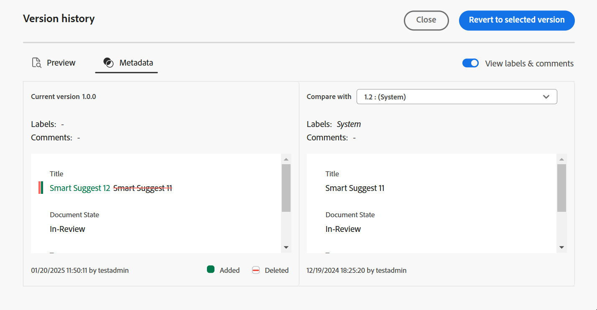
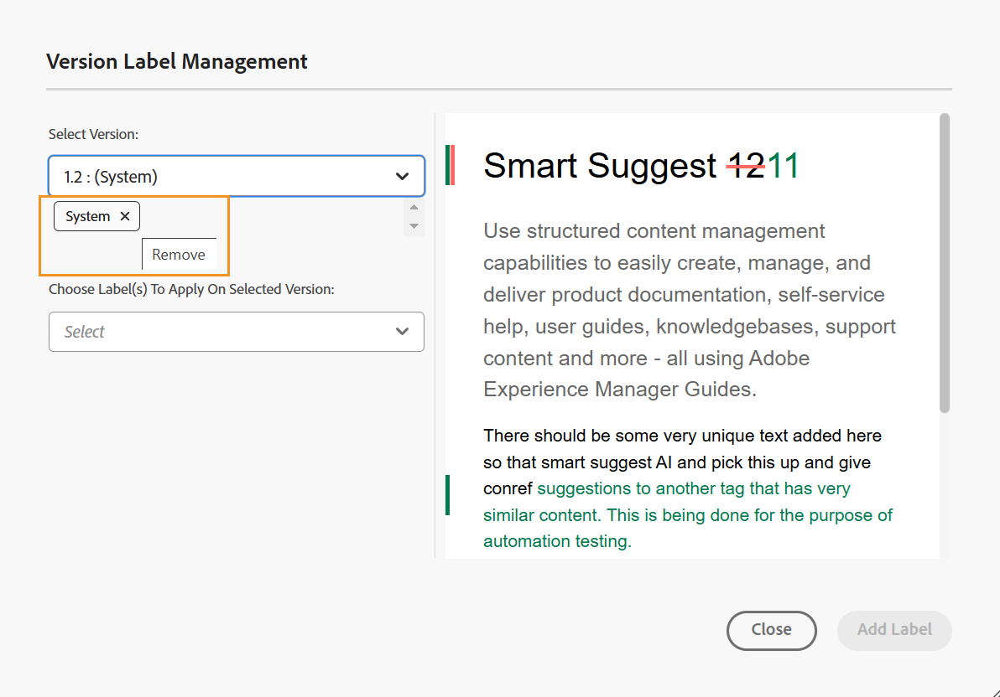

# Usar rótulos {#id164JBG0M0T1}

O Adobe Experience Manager Guides permite adicionar rótulos a diferentes versões de um arquivo. Você pode usar esses rótulos para especificar a versão que deseja incluir em uma linha de base para publicação. Para obter mais informações sobre como usar rótulos para criar uma linha de base, consulte [Trabalhar com Linha de Base](generate-output-use-baseline-for-publishing.md#).

Por exemplo, se você quiser usar a *versão 1.0* de um tópico na *versão 1.0* e na *versão 1.1* do mesmo tópico na *versão 2.0*, poderá adicionar o rótulo *versão 1.0* na *versão 1.0* e na *versão 2.0* na *versão 1.1*.

Após adicionar os rótulos, é possível criar uma linha de base e especificar qual versão do tópico deve ser incluída para publicação usando essa linha de base. Para exibir qual versão deve ser incluída ou excluída em uma linha de base, é possível usar a opção Histórico de Versões.

## Adicionar um rótulo do Editor

Execute as seguintes etapas para adicionar um rótulo ao seu tópico do Editor:

1. No painel Repositório, navegue até um tópico e abra-o no Editor.
1. Selecione **Rótulo de versão** na lista suspensa **Menu**.

   A caixa de diálogo **Gerenciamento de Rótulos de Versão** é exibida.

1. Na caixa de diálogo **Gerenciamento de Rótulos de Versão**, selecione uma versão à qual deseja adicionar um rótulo.
1. Selecione um rótulo para a versão selecionada e selecione **Adicionar rótulo**.

   {width="650"}

   >[!NOTE]
   >
   > Não é possível adicionar o mesmo rótulo às diferentes versões de um tópico. Entretanto, é possível adicionar vários rótulos à mesma versão de um tópico.
1. Confirme para aplicar os rótulos no prompt de confirmação.

   Os rótulos são exibidos no Histórico de Versões do tópico selecionado.

   {width="650"}

   >[!NOTE]
   >
   > Usando uma linha de base, é possível adicionar um rótulo a vários tópicos. Para obter mais informações sobre como adicionar rótulos usando a linha de base, exiba [Adicionar rótulos a uma Linha de Base](generate-output-use-baseline-for-publishing.md#id184KD0T305Z).

Para excluir um rótulo de versão de um tópico, use o ícone **Remover** fornecido em relação a cada rótulo adicionado na caixa de diálogo Gerenciamento de Rótulos de Versão.

## Trabalhar com rótulos da interface do usuário do Assets

Também é possível adicionar rótulos a um tópico e excluí-los, conforme necessário, da interface do usuário do Assets.

Execute as seguintes etapas para adicionar um rótulo a um tópico da interface do usuário do Assets:

1. Na interface do Assets, selecione um tópico e abra-o.
1. Selecione o ícone do seletor do painel esquerdo e selecione **Histórico de versões**.
1. Na lista suspensa Histórico de versões, selecione uma versão à qual deseja adicionar um rótulo.
1. Insira um rótulo para a versão selecionada e pressione Enter. Por exemplo, *2.6 Versão*.

   >[!NOTE]
   >
   > Não é possível adicionar o mesmo rótulo às diferentes versões de um tópico. Entretanto, é possível adicionar vários rótulos à mesma versão de um tópico.

   Os rótulos são exibidos no Histórico de Versões do tópico selecionado. A captura de tela a seguir exibe os rótulos *x.x Versão* e *Guia do Usuário* adicionados à versão destacada do tópico.

   {width="300"}

>[!NOTE]
>
> Usando uma linha de base, é possível adicionar um rótulo a vários tópicos. Para obter mais informações sobre como adicionar rótulos usando a linha de base, exiba [Adicionar rótulos a uma Linha de Base](generate-output-use-baseline-for-publishing.md#id184KD0T305Z).

Para excluir um rótulo de versão de um tópico, use o botão **Excluir** fornecido em relação a cada rótulo no painel Histórico de Versão.

{width="300"}

**Tópico pai:**[ Introdução ao Editor](web-editor.md)
