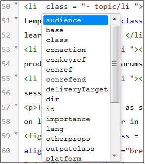

# Visualizações do editor para tópicos {#id204GK0D0V5Z}

A interface do Editor no Adobe Experience Manager permite a visualização de tópicos em três modos ou visualizações diferentes:

* [Autor](#author)
* [Origem](#source)
* [Visualização](#preview)

## Autor

Este é um típico **O que você vê é o que você obtém** visualização \(WYSISYG\) do editor. É possível editar o tópico como faria em qualquer editor de rich text comum. Na exibição Autor, você tem as opções para salvar uma revisão do documento, localizar e substituir conteúdo, inserir elemento, inserir hiperlink, inserir referência de conteúdo e muito mais.

>[!NOTE]
>
> Quando você usa a referência de conteúdo, o conteúdo referenciado também é exibido na exibição Autor em azul. O conteúdo referenciado não é editável.

## Origem

A visualização Source exibe o XML subjacente que compõe o tópico. Se você se sentir confortável trabalhando diretamente com XML, use a visualização Source. Além de fazer edições de texto regulares nessa visualização, você também pode adicionar elementos e atributos usando o Catálogo inteligente ou localizar e substituir texto, elementos ou atributos.

* Para chamar o Catálogo inteligente, coloque o cursor no final de qualquer tag de elemento onde deseja inserir o novo elemento e insira &quot;&lt;&quot;. O editor mostra uma lista de todos os elementos XML válidos que você pode inserir nesse local. Use as teclas de seta para selecionar o elemento que deseja inserir e pressione Enter. Ao inserir o colchete &quot;\>, a tag de fechamento do elemento é adicionada automaticamente.

  {width="400" align="left"}

* Você também pode alterar um elemento facilmente na exibição do Source. Por exemplo, se você alterar a marca de abertura de um elemento `p` para `note`, a marca de fechamento `p` será automaticamente alterada para `/note`. Caso substitua um elemento por um elemento incorreto, você verá imediatamente o Erro de validação.

* Se quiser adicionar um atributo a um elemento, coloque o cursor dentro da tag element e pressione a barra Espaço. Uma lista de atributos válidos para esse elemento é mostrada no Catálogo inteligente. Use as teclas de seta para selecionar o elemento desejado e pressione Enter para inserir o elemento. Para especificar um valor para o atributo, digite o sinal de igual \(=\) e o editor insere automaticamente as aspas de abertura e fechamento &quot; &quot;, onde você pode especificar o valor do atributo.

  {width="350" align="left"}

* Na visualização Source, há uma opção de Recuo automático que reorganiza o código XML no formato apresentável e facilmente legível. Além disso, se você selecionar qualquer texto e alternar da exibição Autor para Source ou da exibição Source para Autor, o texto selecionado também será destacado na outra exibição.
* Outro recurso poderoso na visualização Source é a validação XML no documento. Se você abrir um documento contendo XML inválido, ele será aberto na visualização Source com as informações sobre XML inválido. Por exemplo, na captura de tela a seguir, a informação exata sobre o XML incorreto é fornecida na janela pop-up Erro de análise.

  {width="650" align="left"}

  Na captura de tela acima, um destaque cruzado é usado para apontar a linha que contém XML incorreto.

* O recurso Localizar e substituir permite procurar qualquer texto, elemento ou atributo na Exibição do Source.
Para obter mais detalhes, exiba a descrição do recurso **Localizar e Substituir** na seção [Barra de guias](web-editor-features.md#tab-bar).

* A Exibição do Source fornece muitos atalhos para ajudá-lo a navegar e trabalhar rapidamente em um documento. A tabela a seguir lista as ações compatíveis e suas teclas de atalho:

  | Para fazer isso | Usar este atalho |
  |----------|-----------------|
  | Adicionar vários cursores | **Ctrl**+Clique com o botão esquerdo |
  | Várias seleções de texto não consecutivas | **Ctrl**+Clique com o botão esquerdo para arrastar e selecionar texto |
  | Selecionar texto entre e entre linhas | **Alt**+Clique com o botão esquerdo do mouse para arrastar e selecionar texto |
  | Desfazer seleção múltipla ou sair do modo de tela cheia | **Esc** |
  | Mostrar preenchimento automático | **Ctrl**+**Espaço** |
  | Ir para a tag de abertura ou fechamento da tag atual | **Ctrl**+**J** |
  | Expandir ou recolher a tag atual e seu conteúdo | **Ctrl**+**Q** |
  | Selecionar o elemento atual e seu conteúdo | **Ctrl**+**L** |
  | Recuar para a esquerda o elemento atual | **Shift**+**Guia** |
  | Excluir o elemento atual e seu conteúdo | **Shift**+**Ctrl**+**K** |
  | Mover o cursor uma palavra para a esquerda | **Alt**+**Seta para a Esquerda** |
  | Mover o cursor uma palavra para a direita | **Alt**+**Seta para a Direita** |
  | Rolar uma linha para cima sem alterar a localização do cursor | **Ctrl**+**Seta para Cima** |
  | Rolar uma linha para baixo sem alterar a localização do cursor | **Ctrl**+**Seta para Baixo** |
  | Alternar tela inteira | **F11** |
  | Inserir uma nova linha após o elemento atual | **Ctrl**+**Enter** |
  | Inserir uma nova linha antes do elemento atual | **Shift**+**Ctrl**+**Enter** |
  | Localizar e selecionar a próxima ocorrência da palavra atual | **Ctrl**+**D** |
  | Mover o elemento atual e seu conteúdo um elemento para cima | **Shift**+**Ctrl**+**Seta para Cima** |
  | Mover o elemento atual e seu conteúdo um elemento para baixo | **Shift**+**Ctrl**+**Seta para Baixo** |
  | Envolver o elemento atual na tag de comentário | **Ctrl**+**/** |
  | Duplicar o elemento atual e seu conteúdo | **Shift**+**Ctrl**+**D** |
  | Excluir o texto após o cursor. Se o cursor estiver antes de um elemento de abertura, o elemento inteiro será excluído. | **Ctrl**+**K**+**K** |
  | Exclui o texto à esquerda do cursor na linha atual. Se o cursor estiver após a tag de fechamento de um elemento, o elemento inteiro será excluído. | **Ctrl**+**K**+**Backspace** |
  | Converter o texto atual em maiúsculas | **Ctrl**+**K**+**U** |
  | Converter o texto atual em minúsculas | **Ctrl**+**K**+**L** |
  | Rolar o elemento atual para o centro do editor | **Ctrl**+**K**+**C** |
  | Adicionar um cursor acima da posição atual | **Ctrl**+**Alt**+**Seta para Cima** |
  | Adicionar um cursor abaixo da posição atual | **Ctrl**+**Alt**+**Seta para Baixo** |
  | Localizar recursivamente a palavra atual \(na direção anterior\) | **Ctrl**+**F3** |
  | Localizar recursivamente a palavra atual \(na direção inversa\) | **Shift**+**Ctrl**+**F3** |

## Visualização

Abrir um tópico no modo de Visualização mostra como um tópico será exibido quando for visualizado por um usuário em seu navegador. No caso de um mapa DITA, uma visualização do mapa é mostrada, onde um único documento composto de todos os tópicos no mapa é mostrado.

O modo de Visualização oferece as seguintes funcionalidades:

* [Exibir conteúdo com base em filtros condicionais](#id2114BI00VXA)
* [Exibir as marcações de alterações de controle](#id2114BJ00CE8)
* [Exportar um tópico como PDF](#id2114BL00B5U)

### Exibir conteúdo com base em filtros condicionais {#id2114BI00VXA}

Se você tiver usado condições em seu tópico ou mapa, essas condições serão mostradas no painel Filtros. Por padrão, todas as condições são selecionadas e todo o conteúdo é exibido. Se você desmarcar uma condição, o conteúdo que tem essa condição será removido da visualização. Você também pode optar por destacar conteúdo condicional.

A imagem a seguir mostra um tópico que usa duas condições — `Audience` e `Product`. O conteúdo condicional é realçado com o plano de fundo amarelo.

{align="left"}

### Exibir as marcações de alterações de controle {#id2114BJ00CE8}

Se um documento contiver marcas de alteração de faixa \(ou dicas visuais\), você também poderá visualizar o documento com ou sem essas marcas. Ao visualizar um documento, o painel direito contém as opções Filtros e Rastreamento.

{width="400" align="left"}

Há três opções de **Rastreamento** que você pode escolher:

* **Sem Marcação**: nesta exibição, todas as inserções e exclusões são aceitas, e uma exibição simples do documento é apresentada. Nesta exibição, você não visualiza nenhuma marcação de alteração de rastreamento.
* **Original**: neste modo de exibição, todas as inserções são rejeitadas e todas as exclusões são restauradas novamente, e uma visualização é mostrada. Basta obter a forma original do documento antes de ativar o modo de controle de alterações.
* **Mostrar Marcação**: nesta exibição, você obtém todas as marcações para conteúdo inserido e excluído.

  A imagem a seguir mostra a pré-visualização de um arquivo de mapa com marcações:

  {width="300" align="left"}

### Exportar um tópico como PDF {#id2114BL00B5U}

O PDF é um dos formatos de saída mais comuns usado em cada estágio possível do ciclo de desenvolvimento do documento. O Experience Manager Guides oferece a flexibilidade de gerar a PDF de um tópico individual ou de um arquivo de mapa inteiro. O recurso Exportar como PDF permite que o Autor, Editor ou Administrador gerem facilmente a saída do PDF para um tópico individual. Ele usa as configurações DITA-OT salvas no perfil de nível de pasta para gerar o PDF.

Esse recurso oferece suporte às seguintes funcionalidades:

* Gerar o PDF da cópia de trabalho ativa no momento de um tópico.
* Aceite o nome da transformação DITA-OT e os argumentos da linha de comando para gerar o PDF.
* Salve a saída gerada no sistema local.
* Resolva as referências de chave e conteúdo usadas no tópico antes de gerar a saída.

Para exportar um tópico como PDF, siga estas etapas:

1. Abra o tópico no modo Visualização. Certifique-se de que o tópico faça parte de um arquivo de mapa.

1. Selecione a opção **Baixar como PDF** na parte superior.

   Ícone .

   >[!NOTE]
   >
   > Certifique-se de ter ativado a janela pop-up na configuração do navegador; caso contrário, o PDF não será baixado.

   A PDF é gerada e aberta em uma nova guia ou você verá uma caixa de diálogo para salvar a PDF no sistema local.

**Tópico pai:**[ Introdução ao Editor](web-editor.md)
