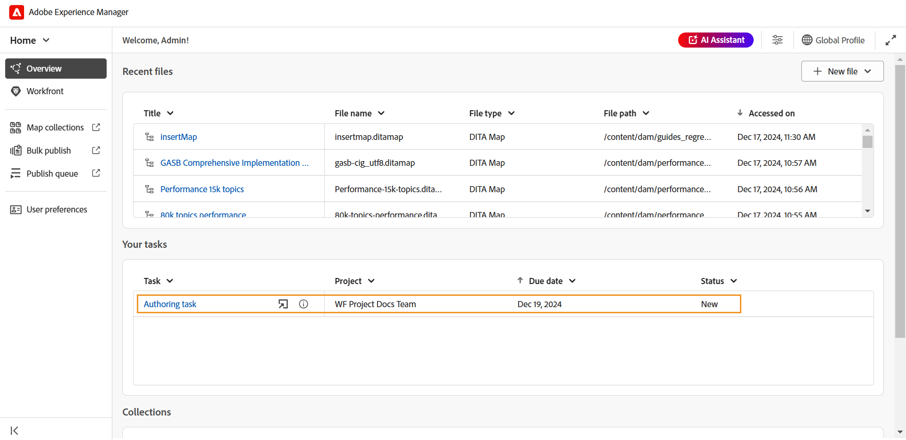
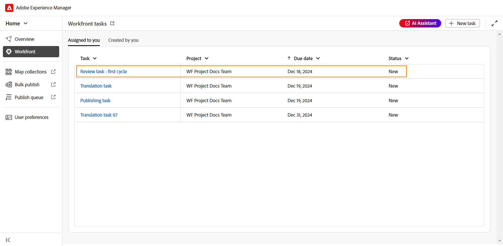

# Integração do Workfront

O Adobe Workfront é uma solução de gerenciamento de trabalho baseada em nuvem que ajuda equipes e organizações a planejar, rastrear e gerenciar seu trabalho com eficiência. A integração entre o Experience Manager Guides e o Adobe Workfront oferece acesso a recursos robustos de gerenciamento de projetos além dos principais recursos do CCMS do Experience Manager Guides, permitindo planejar, alocar e rastrear tarefas com eficiência.

Com essa integração, você pode criar e gerenciar tarefas do Adobe Workfront diretamente da Experience Manager Guides. Por exemplo, como autor, você pode criar uma tarefa de revisão (com um ou mais tópicos ou mapas DITA adicionados) diretamente na interface do Experience Manager Guides e atribuí-la a um revisor. Como revisor, você pode trabalhar nas tarefas atribuídas na interface do usuário do Experience Manager Guides Review e retorná-las ao autor com comentários. Da mesma forma, é possível criar uma tarefa de publicação e tradução e atribuí-la aos usuários necessários para trabalhar nela.

A integração também oferece a capacidade de monitorar suas filas de trabalho, garantindo que você permaneça organizado e no topo de todas as suas tarefas (tarefas atribuídas).

**Principais recursos**

Com a integração do Experience Manager Guides e do Adobe Workfront, você pode:

* Planeje, aloque e acompanhe o progresso de tarefas e projetos individuais sem depender de várias ferramentas não integradas.
* Gerencie todos os fluxos de trabalho do Experience Manager Guides, inclusive criação, revisão, publicação e tradução de conteúdo com mais eficiência.
* Receba notificações por email da Adobe Workfront sempre que novas tarefas forem atribuídas. Para obter mais detalhes, consulte [Visão geral das notificações](https://experienceleague.adobe.com/en/docs/workfront/using/basics/use-notifications/wf-notifications).
* Monitore a integridade do projeto usando o painel intuitivo do Adobe Workfront, que oferece insights em tempo real sobre o desempenho do projeto.

  Para saber mais sobre os recursos robustos de gerenciamento de projetos da Adobe Workfront habilitados para gerentes de projeto na Experience Manager Guides, veja [Planejar uma visão geral do projeto](https://experienceleague.adobe.com/en/docs/workfront/using/manage-work/projects/plan-a-project/plan-project).

## Introdução

Depois de configuradas e habilitadas pelo administrador, as tarefas do Adobe Workfront podem ser acessadas diretamente da [Página inicial do Experience Manager Guides](./intro-home-page.md).

Execute as seguintes etapas para acessar suas tarefas do Adobe Workfront:

1. Faça logon no Experience Manager Guides e abra a **Home page**.
2. No painel esquerdo, selecione **Workfront**.

   A página **tarefas do Workfront** é exibida.

   {align="left"}
3. Selecione **Entrar**.

   Você é redirecionado para a página de logon da Adobe Workfront.
4. Entre usando o mesmo endereço de email usado no Experience Manager Guides e selecione **Permitir acesso** para permitir que o aplicativo acesse sua conta do Adobe Workfront.

   Você é redirecionado automaticamente para a página **Tarefas do Workfront** no Experience Manager Guides.

   {align="left"}

## Recursos disponíveis na página de tarefas do Workfront

Os seguintes recursos estão disponíveis na página de tarefas do Workfront:

* [Nova tarefa](#create-workfront-tasks): permite criar tarefas do Adobe Workfront diretamente da interface do Experience Manager Guides.
* [Atribuído a você](#managing-tasks-assigned-to-you): lista todas as tarefas atribuídas a você e que ainda estão ativas.
* [Criado por você](#managing-tasks-created-by-you): lista todas as tarefas que você criou e que ainda estão ativas.

A página de tarefas do Workfront também inclui um ícone de link externo , que, quando selecionado, leva você à página de projeto do Adobe Workfront. Aqui, você pode exibir detalhes da tarefa, exibir comentários, adicionar comentários e acessar outros recursos com base nas permissões mapeadas com sua conta do Adobe Workfront.

Para obter mais detalhes, consulte [Visão geral das datas do Projeto, da Tarefa e do Problema no Workfront](https://experienceleague.adobe.com/en/docs/workfront/using/basics/navigate/definitions-pti-dates).

### Criar tarefas do Workfront

Você pode criar tarefas do Adobe Workfront diretamente da interface do Experience Manager Guides usando o botão **Nova tarefa** presente na página de tarefas do Workfront.

Execute as seguintes etapas para criar uma nova tarefa do Adobe Workfront:

1. Na página de tarefas do Workfront, selecione **Nova tarefa**.

   A caixa de diálogo **Criar tarefa** é exibida.

   {align="left"}
2. Na guia **Geral**, insira os seguintes detalhes da tarefa:

   * **Tipo de tarefa**: selecione o tipo de tarefa que deseja criar. As opções disponíveis são: **Criação**, **Revisão**, **Publicação** e **Tradução**.
   * **Projeto**: selecione o projeto no qual deseja criar a tarefa.
   * **Nome da tarefa**: digite um nome descritivo para a tarefa.
   * **Descrição**: insira uma breve descrição da tarefa.
   * **Vencimento em**: definir a data de término para a conclusão da tarefa.
   * **Atribuído**: selecione um destinatário para a tarefa.
3. Na guia **Assets**, selecione **Adicionar** para adicionar um ativo a esta tarefa.

   {align="left"}

   * Para tarefas de criação, publicação e tradução, você será solicitado a selecionar o local do arquivo necessário na caixa de diálogo **Selecionar caminho**. O arquivo selecionado (um tópico para criação e mapa para publicação e tradução) é adicionado à tarefa assim que o botão **Criar** é selecionado.

     {align="left"}

   * Para tarefas de revisão, primeiro é solicitado que você selecione o Tipo de ativo (Mapa ou Tópicos) e, em seguida, os arquivos selecionados são exibidos da seguinte maneira:

     {align="left"}

     *Adicionando tópicos a uma tarefa de revisão*

     {align="left"}

     *Adicionando mapas a uma tarefa de revisão*

     As seguintes ações estão disponíveis para modificar sua seleção antes de enviar para revisão:

      * Desmarque alguns tópicos da lista.
      * Filtrar a lista de tópicos com base no estado do documento.
      * Edite ou defina a versão dos tópicos selecionados como **Versão mais recente**, **Versão com base em datas** e **Linha de Base** (disponível somente para mapas) de acordo com a necessidade.

     Para obter mais detalhes, exiba [enviar tópicos para revisão](./review-send-topics-for-review.md).

   >[!NOTE]
   >
   > Adicionar um ativo a uma tarefa fornece aos atribuídos acesso rápido a um tópico, mapa ou qualquer outro arquivo no qual precisem trabalhar. Para tarefas de criação, publicação e tradução, adicionar um ativo é opcional, mas pode ser útil para simplificar os fluxos de trabalho. No entanto, para tarefas de revisão, é obrigatório adicionar um ativo.

4. Selecione **Criar**.

Uma nova tarefa é criada e listada na guia **Criado por você**.

>[!NOTE]
>
> Como gerente de projeto, você pode visualizar essa tarefa recém-criada no painel do Adobe Workfront juntamente com outros detalhes importantes da tarefa. Para obter mais detalhes, consulte [Compreender painéis](https://experienceleague.adobe.com/en/docs/workfront/using/reporting/dashboards/understand-dashboards/understand-dashboards).

### Gerenciar tarefas criadas por você

Todas as tarefas que você criou e que ainda estão ativas são exibidas na guia **Criado por você** na página de tarefas do Workfront, fornecendo detalhes importantes da tarefa, como nome do projeto, responsáveis, data de criação da tarefa, data de conclusão da tarefa e status da tarefa.

{align="left"}

As seguintes opções estão disponíveis quando você passa o mouse sobre uma tarefa presente na guia Criado por você:

**Abrir** - 

Permite abrir a tarefa. Dependendo do tipo de tarefa, ela será aberta no Editor, no Console de mapas ou na Interface de revisão.

**Editar** - 

Permite editar detalhes da tarefa adicionados durante a criação da tarefa. Todos os campos são editáveis, exceto Task type e Project. Só é possível editar tarefas que foram criadas por você. Não é possível editar tarefas atribuídas.

Além disso, você pode adicionar ou remover ativos ao editar uma tarefa de Criação, Publicação ou Tradução. No entanto, para uma tarefa de Revisão, é possível alterar somente a versão dos ativos enviados para revisão.

**Detalhes da tarefa** - 

Exibe as informações da tarefa, incluindo detalhes inseridos durante a criação da tarefa, status da tarefa e quaisquer ativos adicionados.

### Gerenciamento de tarefas atribuídas a você

Todas as tarefas atribuídas a você e que ainda estão ativas são exibidas na guia **Atribuído a você** na página de tarefas do Workfront, fornecendo detalhes importantes da tarefa, como nome do projeto, responsáveis, data de vencimento e status da tarefa.

{align="left"}

As seguintes opções estão disponíveis quando você passa o mouse sobre uma tarefa presente na guia Atribuído a você:

**Abrir** - 

Permite abrir a tarefa. Dependendo do tipo de tarefa, ela será aberta no Editor, no Console de mapas ou na Interface de revisão.

**Detalhes da tarefa** - 

Exibe as informações da tarefa, incluindo detalhes inseridos durante a criação da tarefa, status da tarefa e quaisquer ativos adicionados.

{align="left"}

#### Acesso às tarefas atribuídas na seção Visão geral

Você também pode acessar suas tarefas atribuídas do Adobe Workfront na [seção Visão geral](./intro-home-page.md#overview). A seção Visão geral, quando selecionada, apresenta diferentes widgets que ajudam a manter o foco e a organização.

**Suas tarefas** é um widget onde uma lista de tarefas do Adobe Workfront (que estão atribuídas a você e ainda estão ativas) é exibida junto com os detalhes principais da tarefa, incluindo o nome da tarefa, o projeto associado, a data de vencimento e o status atual.

{align="left"}

Semelhante à guia Atribuído a você, o widget Suas tarefas também fornece opções para **Abrir** e exibir **detalhes da tarefa** ao passar o mouse sobre uma tarefa.

O widget também fornece opções para classificar e redimensionar colunas para uma exibição personalizada. Para aplicar a classificação a uma coluna, selecione o cabeçalho da coluna e as opções seriam exibidas em uma lista. Para ajustar a largura de uma coluna, passe o mouse sobre a linha divisória de coluna no cabeçalho e arraste para redimensionar.

>[!NOTE]
>
> Quando estiver fora da interface do Experience Manager Guides, você receberá uma notificação por email da Adobe Workfront para qualquer tarefa recém-atribuída. Para fazer check-out dessas tarefas, faça logon na instância do Experience Manager Guides e acesse as tarefas atribuídas.

## Trabalhar com tarefas atribuídas do Adobe Workfront

Há quatro tipos de tarefas do Adobe Workfront que você pode criar e atribuir ou trabalhar quando atribuídas no Experience Manager Guides:

1. [Tarefas de criação](#authoring-tasks)
2. [Revisar tarefas](#review-tasks)
3. [Tarefas de tradução](#translation-tasks)
4. [Publicar tarefas](#publishing-tasks)

As seções a seguir o orientam pelo processo detalhado de trabalho nas tarefas atribuídas do Adobe Workfront.

### Tarefas de criação

Execute as seguintes etapas para trabalhar em uma tarefa de criação:

1. Acesse a tarefa na seção [Visão geral](#accessing-assigned-tasks-from-overview-section) ou na guia [Atribuído a você](#managing-tasks-assigned-to-you).

   {align="left"}

   *Tarefa de criação na guia Atribuído a você*

   {align="left"}

   *Tarefa de criação no widget Suas tarefas*
2. Passe o mouse sobre a tarefa que deseja trabalhar e selecione    para abri-lo. Você também pode abrir a tarefa simplesmente selecionando-a.

   Todas as tarefas de criação são abertas no Editor.
3. Revise os detalhes da tarefa na guia **Detalhes** e selecione o arquivo **Ativo** para abri-lo.

   {align="left"}

4. Faça as edições necessárias e selecione **Marcar como concluído**.
5. Alterne para a guia **Comentários** para adicionar um comentário a esta tarefa. Esses comentários, adicionados no nível da tarefa, também refletirão no painel de projetos do Adobe Workfront.

   >[!NOTE]
   >
   > Quando a tarefa estiver marcada como concluída, ela será removida da lista de tarefas atribuídas e da lista de tarefas **Criadas por você** do iniciador da tarefa.

### Revisar tarefas

Como revisor, você pode revisar as tarefas de revisão do Adobe Workfront atribuídas a você.

Execute as seguintes etapas para trabalhar em uma tarefa de revisão atribuída a você.

1. Acesse a tarefa na seção [Visão geral](#accessing-assigned-tasks-from-overview-section) ou na guia [Atribuído a você](#managing-tasks-assigned-to-you).

   {align="left"}

   *Tarefa de revisão na guia Atribuído a você*

   {align="left"}

   *Tarefa de criação no widget Suas tarefas*
2. Passe o mouse sobre a tarefa que deseja trabalhar e selecione    para abri-lo. Você também pode abrir a tarefa simplesmente selecionando-a.

   Para revisores, a tarefa de revisão é aberta na **Interface de revisão**.

   {align="left"}

3. Execute a revisão necessária. Para obter detalhes sobre como revisar um tópico, exiba [tópicos de revisão](./review-topics.md).
4. Após a conclusão da revisão, selecione **Marcar como concluído**.
5. Alterne para a guia **Comentários** para adicionar um comentário a esta tarefa. Esses comentários, adicionados no nível da tarefa, também refletirão no painel de projetos do Adobe Workfront.

Marcar a tarefa como concluída pelo revisor não indica a conclusão da tarefa. Todas as tarefas de revisão são atribuídas de volta ao usuário que criou a tarefa (idealmente um autor que solicitou uma revisão).

>[!NOTE]
>
> Se a tarefa for atribuída a vários revisores, ela será reatribuída ao criador da tarefa somente depois que todos os revisores a marcarem como concluída.

As tarefas de revisão reatribuídas ao criador/autores para incorporação de revisão podem ser acessadas na seção [Visão geral](#accessing-assigned-tasks-from-overview-section) ou na guia [Atribuído a você](#managing-tasks-assigned-to-you).

{align="left"}

*Tarefa de revisão atribuída de volta aos autores*

Para essas tarefas, o estado da tarefa do destinatário muda para **Criação**, enquanto o tipo de tarefa permanece como **Revisão**. Essa alteração de estado acontece quando a revisão é concluída por todos os revisores.

{align="left"}

Selecionar a tarefa ou o ícone de abertura  abre a tarefa no Editor, onde o autor pode [endereçar comentários de revisão](../user-guide/review-address-review-comments.md), editar a tarefa atualizando a versão dos tópicos e atribuir novamente a tarefa ao revisor, se necessário.

Autor também pode editar a tarefa e atribuí-la a outro autor, delegando a tarefa de incorporar os comentários. Para fazer isso, selecione **Editar**, altere o estado da Tarefa para **Criação** e selecione **Alterar destinatário**. Agora você pode selecionar um destinatário na lista.

Esse processo forma um ciclo contínuo, em que a tarefa se move para frente e para trás entre o autor e o revisor até ser totalmente concluída. Depois que todas as alterações sugeridas forem incorporadas, o autor poderá concluir a tarefa selecionando **Marcar como concluído**.

### Tarefas de tradução

É possível executar várias ações de tradução em tarefas de tradução do Adobe Workfront atribuídas a você.

Execute as seguintes etapas para trabalhar em uma tarefa de tradução:

1. Acesse a tarefa na seção [Visão geral](#accessing-assigned-tasks-from-overview-section) ou na guia [Atribuído a você](#managing-tasks-assigned-to-you).

   {align="left"}

   *Tarefa de tradução na guia Atribuído a você*

   {align="left"}

   *Tarefa de tradução no widget Suas tarefas*

2. Passe o mouse sobre a tarefa que deseja trabalhar e selecione    para abri-lo no **Console de mapas**. Você também pode abrir a tarefa simplesmente selecionando-a.
3. Revise os detalhes da tarefa e o arquivo adicionado para tradução.

   {align="left"}
4. Navegue até a guia **Tradução** para obter as várias opções de tradução. Saiba como [traduzir conteúdo](../user-guide/translation.md) no Experience Manager Guides.
5. Execute a tradução necessária e selecione **Enviar para tradução**.
   {align="left"}
6. Navegue até a seção **Workfront** e selecione **Marcar como concluído** para indicar que a tarefa foi concluída.
7. Alterne para a guia **Comentários** para adicionar um comentário a esta tarefa. Esses comentários, adicionados no nível da tarefa, serão refletidos no painel de projetos do Adobe Workfront.

   >[!NOTE]
   >
   > Quando a tarefa estiver marcada como concluída, ela será removida da lista de tarefas atribuídas e da lista de tarefas **Criadas por você** do iniciador da tarefa.

### Publicar tarefas

Como editor, você pode exibir detalhes e publicar uma tarefa de publicação atribuída a você.

Execute as seguintes etapas para trabalhar em uma tarefa de publicação:

1. Acesse a tarefa na seção [Visão geral](#accessing-assigned-tasks-from-overview-section) ou na guia [Atribuído a você](#managing-tasks-assigned-to-you).

   {align="left"}

   *Publicando tarefa na guia Atribuído a você*

   {align="left"}

   *Publicando tarefa no widget Suas tarefas*
2. Passe o mouse sobre a tarefa que deseja trabalhar e selecione    para abri-lo no **Console de mapas**. Você também pode abrir a tarefa simplesmente selecionando-a.
3. Revise os detalhes da tarefa e o arquivo adicionado para publicação.

   {align="left"}
4. Navegue até **Predefinições de saída** e execute as ações de publicação necessárias para publicar a tarefa. Para obter mais detalhes, consulte [Noções básicas sobre as predefinições de saída](../user-guide/generate-output-understand-presets.md/).
5. Após a conclusão da publicação, navegue até a seção **Workfront** e selecione **Marcar como concluído** para indicar que a tarefa foi concluída.
6. Alterne para a guia **Comentários** para adicionar um comentário a esta tarefa. Esses comentários, adicionados no nível da tarefa, serão refletidos no painel de projetos da Workfront.

   >[!NOTE]
   >
   > Quando a tarefa estiver marcada como concluída, ela será removida da lista de tarefas atribuídas e da lista de tarefas **Criadas por você** do iniciador da tarefa.
