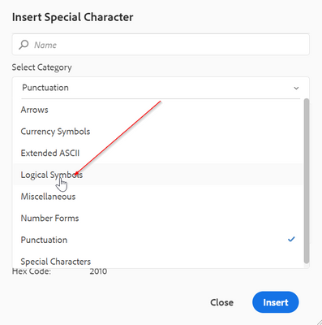

# Como configurar caracteres especiais adicionais na barra de ferramentas do Editor da Web

Há uma opção de atalho na barra de ferramentas do editor da Web para permitir que o autor insira os caracteres especiais.
O mesmo pode ser visto na captura de tela abaixo:


Essa lista de caracteres pode ser configurada aqui. Se precisar adicionar mais caracteres a isso, siga as etapas abaixo:

+ Faça logon no AEM e abra o modo CRXDE Lite.

+ Crie o arquivo symbol.json no seguinte local: &#39;/apps/fmdita/xmleditor/&#39; (Você pode copiar o padrão de - local &#39;/libs/fmdita/clientlibs/clientlibs/xmleditor/symbols.json&#39;)

+ Adicione a definição de caractere especial no arquivo symbol.json como:

```
{
      "label": "Logical Symbols",
      "items": [
        {
          "name": "≥",
          "title": "Greater-Than or Equal To"
        },
        {
          "name": "≤",
          "title": "Smaller-Than or Equal To"
        }
      ]
}
```

A estrutura do arquivo symbol.json é explicada abaixo:

+ &quot;label&quot;: &quot;Logical Symbols&quot;: especifica a categoria dos caracteres especiais. No trecho, uma categoria com o nome &quot;Símbolo lógico&quot; é definida.

+ &quot;items&quot;: isso define a coleção de caracteres especiais na categoria.

+ &quot;name&quot;: &quot;≥&quot;, &quot;title&quot;: &quot;Greater-Than or Equal To&quot;: esta é a definição do caractere especial. Ela começa com o rótulo &quot;name&quot;, que não deve ser alterado. O nome é seguido pelo caractere especial. O &quot;título&quot; é o nome ou o título do caractere especial que aparece como a dica de ferramenta desse caractere especial.

É possível definir várias definições de caracteres especiais em uma categoria.

Isso adicionará outra categoria na caixa de diálogo de caracteres especiais:




>[!MORELIKETHIS]
>
>+ [Guia de Instalação e Configuração](https://helpx.adobe.com/content/dam/help/en/xml-documentation-solution/3-6/XML-Documentation-for-Adobe-Experience-Manager_Installation-Configuration-Guide_EN.pdf)
